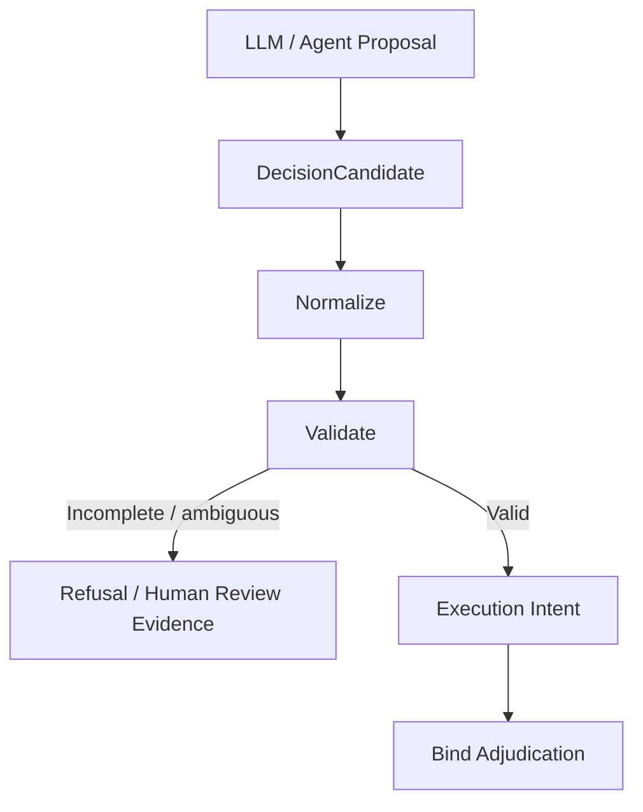

<div align="center">

# VERITAS OS v2.0

### Decision Governance and Bind-Boundary Control Plane for AI Agents

**Control whether an AI-proposed action is allowed to become a real-world effect.**

[](https://doi.org/10.5281/zenodo.17838349)
[-10.5281%2Fzenodo.17838456-0E76A8?logo=doi&logoColor=white)](https://doi.org/10.5281/zenodo.17838456)
[-10.5281%2Fzenodo.22844531-0E76A8?logo=doi&logoColor=white)](https://doi.org/10.5281/zenodo.22844531)
[](https://zenodo.org/records/22844531)


-purple)
[](https://github.com/veritasfuji-japan/veritas_os/actions/workflows/main.yml)
[](https://github.com/veritasfuji-japan/veritas_os/actions/workflows/codeql.yml)
[](https://github.com/veritasfuji-japan/veritas_os/actions/workflows/release-gate.yml)
[](https://github.com/veritasfuji-japan/veritas_os/actions/workflows/publish-ghcr.yml)


[](README_JP.md)
[](https://www.linkedin.com/in/takeshi-fujishita-279709392?utm_source=share&utm_campaign=share_via&utm_content=profile&utm_medium=ios_app)

**[Website](https://veritas-website-navy.vercel.app/)** ·
**[Reviewer Entry Point](docs/REVIEWER_ENTRYPOINT.md)** ·
**[Implementation Matrix](docs/en/validation/current-implementation-matrix.md)** ·
**[Technical Proof Pack](docs/en/validation/technical-proof-pack.md)** ·
**[Execution Governance Paper](https://zenodo.org/records/22844531)**

</div>

---

> [!IMPORTANT]
> ### AI intelligence is not execution authority.
> A model can decide that an action *should* happen. VERITAS determines whether that proposed action is allowed to cross the execution boundary under the authority, policy, approval, evidence, and current state available at execution time.

VERITAS OS is a **Decision Governance and Bind-Boundary Control Plane** for AI agents.

Instead of passing model output directly to tools or external systems, VERITAS treats AI output as a **Decision Candidate** and routes it through explicit governance and execution boundaries before a real-world side effect can be committed.

The core distinction is simple:

> **Authorization at issuance ≠ permission at execution.**

---

## Why VERITAS exists

AI agents can increasingly prepare or initiate consequential actions:

- payments and financial operations
- IAM and permission changes
- production infrastructure changes
- compliance and risk decisions
- external API calls
- customer or operational workflow mutations

The difficult question is no longer only:

> *Can the model decide what to do?*

It is also:

> *What must still be true before the organization allows that decision to become an external effect?*

Between decision and execution, any of the following may change:

- the actor's authority
- the governing policy
- the target or scope
- a human approval's validity
- the execution credential
- the authorization's consumption state
- the external system's state
- the certainty about whether an earlier effect already occurred

VERITAS governs that gap.

---

## Architecture at a glance


```mermaid
flowchart LR
    A["AI / Agent"] --> B["Decision Candidate"]
    B --> C["Governance Evaluation"]
    C --> D["Authority · Policy · Approval · Evidence"]
    D --> E["Execution Authorization"]
    E --> F["Single-Use Consumption"]
    F --> G["Bind Boundary"]
    G --> H["External Effect"]
    H --> I["Receipt / Outcome"]
    I --> J["Read-Only Reconciliation"]
    J --> K["Reviewer Evidence"]
```

| Before execution | At the execution boundary | After execution |
|---|---|---|
| Validate authority | Revalidate current governance | Record outcome |
| Apply policy | Consume authorization once | Preserve evidence |
| Bind human approval | Resolve exact target / credential | Reconcile uncertain effects |
| Validate evidence | Fail closed on ambiguity | Support reviewer verification |

### Mental model

```text
AI / Agent
   proposes
      ↓
VERITAS
   governs
      ↓
Bind Boundary
   permits or blocks
      ↓
External System
   produces an effect
      ↓
VERITAS
   records and reconciles evidence
```

---

## Core execution invariants

VERITAS is built around explicit execution-governance invariants.

| Invariant | Meaning |
|---|---|
| **AI output is a proposal** | Model output does not grant itself execution authority. |
| **Authorization is contextual** | Authority is bound to the relevant action, target, scope, and governance state. |
| **Approval is not reusable permission** | Human approval does not become a general-purpose execution capability. |
| **Authorization is single-use** | A consumed authorization cannot simply authorize another effect. |
| **Current state matters** | Governance conditions are rechecked before effect. |
| **Ambiguity fails closed** | Missing, stale, invalid, or indeterminate evidence does not silently pass. |
| **`EFFECT_UNKNOWN` is explicit** | A lost response is not automatically treated as execution failure. |
| **Blind re-dispatch is prohibited** | An unresolved effect is reconciled instead of automatically retried. |
| **Reconciliation is read-only** | Verification of an effect must not create another effect. |
| **Receipts are evidence, not authority** | Retrospective evidence cannot authorize a new action. |

---

# What has been demonstrated

## Controlled Decision-to-Effect E2E

VERITAS contains a reproducible **current-head Decision-to-Effect proof path** that connects a governed decision to a controlled external effect and back to reviewer-facing evidence.

```text
/v1/decide
    ↓
Canonical Decision Artifact
    ↓
Verified Promotion
    ↓
Native v2 Authorization
    ↓
Single-Use Consumption
    ↓
Current Governance Rechecks
    ↓
TLS POST
    ↓
PostgreSQL Persistence
    ↓
Read-Only Reconciliation
    ↓
BindReceipt / Outcome
```

The dedicated proof path uses:

- real TLS transport
- real PostgreSQL persistence
- durable authorization-consumption records
- current governance rechecks before dispatch
- deterministic decision / authorization / receipt lineage
- read-only reconciliation
- machine-readable proof artifacts
- exact tested commit identity in CI

The business decision, credentials, and external effect are **controlled synthetic fixtures**.

### Normal path

The normal scenario verifies that a governed action can move through:

**Decision → Promotion → Authorization → Consumption → Revalidation → External Effect → Reconciliation → Receipt / Outcome**

without bypassing the defined execution boundary.

### Lost-response fault path

The fault scenario covers a harder case:

```text
External system commits the effect
              ↓
Caller loses the response
              ↓
        EFFECT_UNKNOWN
              ↓
        No blind retry
              ↓
     Read-only reconciliation
              ↓
      Original effect confirmed
```

The proof explicitly preserves the distinction between:

- **no observed response**, and
- **proof that no external effect occurred**.

While the effect is unresolved, VERITAS does not treat the missing response as permission to blindly issue a replacement business event.

### Proof references

- [Reproducible Decision-to-Effect E2E Evidence](artifacts/real-decision-to-effect-e2e/README.md)
- [Controlled Execution Proof Architecture Freeze](docs/architecture/controlled-execution-proof-freeze-v1.json)
- [Reconciliation-Capable Execution Profile Proof](docs/en/validation/reconciliation-capable-execution-profile-proof-v1.md)
- [Runtime Proof CI Evidence](docs/en/guides/runtime-proof-ci-evidence.md)

> [!NOTE]
> A passing controlled proof is evidence for the proof contract and tested commit. It is not blanket production certification.

---

# What the controlled proof does not establish

VERITAS deliberately separates **implemented proof** from **production claims**.

The controlled Decision-to-Effect proof does **not** by itself establish:

- production readiness in every customer environment
- real customer credentials
- real customer endpoints
- live bank integration
- live IAM / IdP / SaaS integration
- external UTC clock trust
- production SLA
- regulatory approval
- compliance certification
- completed third-party audit
- universal bind coverage of every effect-bearing route

> [!CAUTION]
> **Implemented in the repository** does not automatically mean **production-validated in a customer environment**.

The authoritative implementation boundary is maintained in:

**[Current Implementation Matrix](docs/en/validation/current-implementation-matrix.md)**

---

# Current implementation

## Decision governance

`POST /v1/decide` is the main structured decision path.

It produces governance and audit-facing lineage and provides the upstream decision context used by later execution-governance artifacts.

An AI decision is not, by itself, external execution permission.

---

## LLM-to-Control-Plane boundary

VERITAS does not ask an LLM to govern itself.


```mermaid
flowchart TD
    A["LLM / Agent Proposal"] --> B["DecisionCandidate"]
    B --> C["Normalize"]
    C --> D["Validate"]
    D -->|"Incomplete / ambiguous"| E["Refusal / Human Review Evidence"]
    D -->|"Valid"| F["Execution Intent"]
    F --> G["Bind Adjudication"]
```

Incomplete or ambiguous model output is not automatically promoted into an executable intent.

See:

- [LLM-to-Control-Plane Contract](docs/en/architecture/llm-to-control-plane-contract.md)
- [External Reviewer Quickstart](docs/en/demo/external-reviewer-quickstart.md)

---

## Bind-boundary governance

VERITAS represents execution lineage through explicit artifacts and transitions.

```text
Decision
   ↓
Execution Intent
   ↓
Authorization
   ↓
Consumption
   ↓
Bind Adjudication
   ↓
External Effect
   ↓
BindReceipt
   ↓
Outcome
```

The Bind Boundary is the final governance point before a proposed action crosses into an external side effect.

See:

- [Bind Boundary Governance Artifacts](docs/en/architecture/bind-boundary-governance-artifacts.md)
- [External Bind Integration Path](docs/en/guides/external-bind-integration-path.md)

---

## Selected bind-governed operator effects

The repository explicitly documents bind governance for selected operator mutation paths including:

```text
PUT  /v1/governance/policy
POST /v1/governance/policy-bundles/promote
PUT  /v1/compliance/config
POST /v1/system/halt
POST /v1/system/resume
```

This is an explicit documented subset.

VERITAS does not claim that every effect-bearing route is bind-governed unless that route is covered by the relevant bind-coverage documentation and tests.

---

## Authority Evidence

VERITAS provides structured Authority Evidence handling for governance decisions.

Authority evidence can represent:

- identity
- scope grants
- scope limitations
- validity and expiry
- provenance
- deterministic evidence hashes

Missing, invalid, expired, stale, or indeterminate authority evidence can fail closed.

Current repository support includes deterministic local/offline ingestion and validation patterns. It does not imply completed live integration with every enterprise identity, banking, sanctions, or customer authority source.

See:

[Authority Evidence Ingestion](docs/en/architecture/authority-evidence-ingestion.md)

---

## Human Approval Receipt

Human approval is represented as a structured governance artifact rather than a simple Boolean.

Approval can be bound to:

- a specific action
- target
- scope
- decision context
- expiry
- verifier provenance

Secure / production postures require stronger verifier-derived provenance than local test compatibility state.

Human approval does not become an unlimited reusable execution capability.

See:

[Human Approval Receipt](docs/en/architecture/human-approval-receipt.md)

---

## Single-use authorization

VERITAS supports durable single-use authorization-consumption semantics.

The intended invariant is:

```text
one valid decision
        +
one valid approval
        ↓
one contextual authorization
        ↓
one valid consumption
        ↓
one governed effect attempt
```

A previously consumed authorization is not silently treated as fresh authority.

---

## Outcome Receipt

Outcome Receipt artifacts represent post-execution evidence for governed action attempts.

They can capture:

- observed outcome
- commit / block / rollback state
- postcondition status
- state fingerprints
- observed effects
- deterministic hashes

Outcome evidence records what was observed.

It does **not** grant new execution authority.

See:

[Outcome Receipt](docs/en/architecture/outcome-receipt.md)

---

## Evidence Chain and reviewer evidence

VERITAS includes reviewer-facing evidence-chain capabilities including:

- deterministic hashes
- evidence manifests
- validation reports
- Reviewer Evidence Packets
- trusted-public-key provenance workflows
- Ed25519 verification paths
- reproducible handoff artifacts

Integrity and trust are intentionally separated.

A matching hash can support integrity checking relative to an expected value; it does not automatically establish that the underlying authority source or public key should be trusted.

Start here:

- [Reviewer Evidence Index](docs/en/demo/reviewer-evidence-index.md)
- [Reviewer Evidence Assurance Overview](docs/en/demo/reviewer-evidence-assurance-overview.md)
- [Technical Proof Pack](docs/en/validation/technical-proof-pack.md)

---

## Mission Control

Mission Control is the operator-facing governance surface.

It provides visibility into areas such as:

- decisions
- governance state
- audit evidence
- policy workflows
- bind artifacts
- risk state
- system posture

Frontend stack:

| Layer | Technology |
|---|---|
| Framework | Next.js 16.3.3 (App Router) |
| Language | TypeScript 5.7 |
| Styling | Tailwind CSS 3.4 |
| Lint config | eslint-config-next 15.5.10 |
| UI | React |

Mission Control is a governance and review surface. The UI itself is not the source of execution authority.

---

# External execution integration

## WebhookBindAdapter

`WebhookBindAdapter` is the first reference adapter for external bind execution.

It demonstrates an integration pattern involving:

- governed action preparation
- target snapshot
- external HTTPS effect
- deterministic idempotency
- HMAC signing
- postcondition verification
- fail-closed behavior
- compensation semantics where supported
- bind receipts

See:

[WebhookBindAdapter](docs/en/guides/webhook-bind-adapter.md)

This is a **reference integration pattern**, not production certification or proof of a completed customer deployment.

---

## Minimal Python SDK

A minimal Python SDK reference is available at:

[sdk/python/README.md](sdk/python/README.md)

The SDK helps clients interact with VERITAS APIs and prepare integration payloads.

It does not bypass the execution boundary.

```text
SDK request
    ≠
permission for external side effect
```

---

# Regulated Action Governance

VERITAS includes a **Regulated Action Governance Kernel** covering concepts such as:

- Action Class Contract
- Authority Evidence
- Runtime Authority Validation
- Admissibility Predicate
- Human Approval
- Irreversible Commit Boundary
- reviewer-facing evidence

For selected regulated action paths, the kernel is designed to determine whether an execution intent should `commit / block / escalate / refuse` at the Bind Boundary.

See:

- [Regulated Action Governance Kernel](docs/en/architecture/regulated-action-governance-kernel.md)
- [Authority Evidence vs Audit Log](docs/en/architecture/authority-evidence-vs-audit-log.md)
- [AML/KYC Regulated Action Path](docs/en/use-cases/aml-kyc-regulated-action-path.md)
- [Regulated Action Governance Proof Pack](docs/en/validation/regulated-action-governance-proof-pack.md)
- [Regulated Action Governance Quality Gate](docs/en/validation/regulated-action-governance-quality-gate.md)

---

# AML / KYC PoC

The repository includes a deterministic fixture-backed AML/KYC governance PoC for reviewer and pilot workflows.

Start here:

- [AML/KYC 1-Day PoC Quickstart](docs/en/guides/poc-pack-financial-quickstart.md)
- [One-Day PoC Evidence Pack](docs/en/poc/one-day-poc-evidence-pack.md)
- [One-Day PoC Operator Runbook](docs/en/poc/one-day-poc-operator-runbook.md)
- [One-Day PoC Reviewer Handoff Template](docs/en/poc/one-day-poc-reviewer-handoff-template.md)

> [!WARNING]
> Fixture-backed AML/KYC evidence must not be represented as live bank-side production integration.

The AML/KYC customer risk escalation fixture is a deterministic engineering path for reviewing regulated-action governance behavior.

**Audit Log vs Authority Evidence:** an Audit Log records what happened. Authority Evidence records why an action was authorized and admissible at bind time. An Audit Log alone does not authorize commit.

> [!NOTE]
> This is not legal advice, not regulatory approval, and not third-party certification. Repository evidence and controlled proofs should not be interpreted as compliance certification or completed production validation.

---

# PostgreSQL and audit persistence

VERITAS uses pluggable persistence for MemoryOS and TrustLog.

| Environment | Recommended backend |
|---|---|
| Local development | JSON / JSONL |
| Docker development | PostgreSQL |
| Staging | PostgreSQL |
| Secure / production path | PostgreSQL + environment-specific hardening |

PostgreSQL is the formal production storage path documented by this repository.

Repository capabilities include:

- Alembic migrations
- PostgreSQL-backed MemoryOS
- PostgreSQL-backed TrustLog
- advisory-lock chain serialization
- JSONL → PostgreSQL migration tooling
- contention tests
- pool and health observability
- backup / restore / recovery drills

See:

- [PostgreSQL Production Guide](docs/en/operations/postgresql-production-guide.md)
- [PostgreSQL Drill Runbook](docs/en/operations/postgresql-drill-runbook.md)
- [Database Migrations](docs/en/operations/database-migrations.md)
- [PostgreSQL Production Proof Map](docs/en/validation/postgresql-production-proof-map.md)

Production guarantees still depend on the actual deployment infrastructure and operating controls.

---

# Runtime posture

VERITAS supports posture-aware behavior across environments including:

```text
dev → staging → secure → prod
```

Higher-security postures can require stronger controls around:

- signing
- secret management
- approval provenance
- audit persistence
- replay behavior
- WORM storage
- trust evidence
- runtime configuration

See:

[Security Hardening](docs/en/operations/security-hardening.md)

---

# Quick start

## Requirements

- Python 3.11+
- Docker / Docker Compose for the recommended full-stack path
- Node.js 20+ for local frontend development
- an OpenAI API key for the default LLM configuration

## Docker Compose

```bash
git clone https://github.com/veritasfuji-japan/veritas_os.git
cd veritas_os
cp .env.example .env
```

Replace required `CHANGE_ME` values and configure the required application, API, database, and frontend authentication secrets.

Then:

```bash
docker compose up --build
```

| Component | Address |
|---|---|
| Mission Control | `http://localhost:3000` |
| API | `http://localhost:8000` |
| Swagger UI | `http://localhost:8000/docs` |
| PostgreSQL | `localhost:5432` |

Stop:

```bash
docker compose down
```

For Docker security configuration, see:

[Docker Compose Security](docs/en/operations/docker-compose-security.md)

---

## Local development

Install:

```bash
pip install -e ".[dev]"
cp .env.example .env
```

Backend:

```bash
make dev
```

Frontend:

```bash
make dev-frontend
```

Both:

```bash
make dev-all
```

---

## Try the decision API

Open:

```text
http://127.0.0.1:8000/docs
```

Authorize with the configured API credentials and call:

```text
POST /v1/decide
```

Example:

```json
{
  "query": "Should I check tomorrow's weather before going out?",
  "context": {
    "user_id": "test_user",
    "goals": ["health", "efficiency"],
    "constraints": ["time limit"],
    "affect_hint": "focused"
  }
}
```

`/v1/decide` produces a governed decision result.

It does **not** by itself authorize an external side effect.

---

# Validation and CI

## Backend tests

```bash
pytest -q
```

Production-like validation:

```bash
make test-production
```

PostgreSQL smoke validation:

```bash
VERITAS_MEMORY_BACKEND=postgresql \
VERITAS_TRUSTLOG_BACKEND=postgresql \
pytest -m smoke veritas_os/tests/ -q
```

## CI / release evidence

The repository contains workflows covering areas including:

- core CI
- CodeQL
- release gates
- security checks
- reviewer evidence validation
- reproducible Decision-to-Effect proof
- PostgreSQL-backed validation
- release evidence generation

A green workflow should be interpreted according to the **scope of that workflow**.

A passing focused proof is evidence for the proof contract it evaluates; it is not blanket certification of every deployment property.

See:

[Operational Readiness Runbook](docs/en/operations/operational-readiness-runbook.md)

---

# Evidence-first reviewer path

You do not need to read the entire repository to evaluate VERITAS.

## 10-minute path

1. **[README](README.md)** — product and execution-boundary model
2. **[Reviewer Entry Point](docs/REVIEWER_ENTRYPOINT.md)** — guided review path
3. **[Current Implementation Matrix](docs/en/validation/current-implementation-matrix.md)** — implemented vs partial vs roadmap
4. **[Decision-to-Effect E2E Evidence](artifacts/real-decision-to-effect-e2e/README.md)** — controlled execution proof
5. **[Technical Proof Pack](docs/en/validation/technical-proof-pack.md)** — reviewer checklist and proof assets

## Deeper technical review

Continue with:

- [Regulated Action Governance Kernel](docs/en/architecture/regulated-action-governance-kernel.md)
- [External Bind Integration Path](docs/en/guides/external-bind-integration-path.md)
- [External Bind PoC Evidence](docs/en/guides/external-bind-poc-evidence.md)
- [Reconciliation-Capable Execution Profile Proof](docs/en/validation/reconciliation-capable-execution-profile-proof-v1.md)
- [External Audit Readiness](docs/en/validation/external-audit-readiness.md)
- [Validation Evidence Map](docs/en/validation/validation-evidence-map.md)

---

# Current implementation boundary

For the detailed and maintained truth table, use:

**[Current Implementation Matrix](docs/en/validation/current-implementation-matrix.md)**

High-level summary:

| Area | Current repository status |
|---|---|
| Core decision pipeline | Implemented |
| Bind-boundary governance | Implemented / partial route coverage |
| Selected operator effect paths | Explicitly bind-governed |
| Authority Evidence | Implemented / bounded |
| Human Approval Receipt | Implemented / bounded |
| Single-use authorization | Implemented in controlled execution path |
| Outcome Receipt | Implemented |
| Evidence Chain | Implemented |
| Mission Control | Implemented |
| PostgreSQL production path | Implemented / environment dependent |
| Controlled Decision-to-Effect E2E | Implemented |
| AML/KYC fixture PoC | Implemented |
| Live customer integrations | Integration / environment dependent |
| Completed third-party certification | Not claimed |

---

# What VERITAS is not

VERITAS is not:

- an LLM asking itself whether it is safe
- a prompt-only guardrail
- a substitute for IAM
- a substitute for KMS / HSM infrastructure
- a substitute for organizational policy
- proof that every model output is correct
- proof that every external system is trustworthy
- legal advice
- regulatory approval
- automatic production certification

Its role is narrower:

> **Determine whether a proposed AI action is permitted to cross the execution boundary under the evidence and governance state available at that moment.**

---

# Why this differs from post-hoc audit

Traditional audit often answers:

> **What happened?**

VERITAS is designed to make additional questions explicit **before** effect:

| Question | Execution-governance concern |
|---|---|
| Who has authority? | Authority |
| What policy applies? | Admissibility |
| What exactly did the human approve? | Approval binding |
| Is that approval still valid? | Freshness / expiry |
| Has anything materially changed? | Execution-time revalidation |
| Was this authorization already consumed? | Replay prevention |
| What exact target is being bound? | Target / scope integrity |
| Can the action proceed under current evidence? | Bind adjudication |

And after an attempted effect:

| Question | Evidence concern |
|---|---|
| What effect was observed? | Outcome |
| What evidence supports it? | Receipt / evidence chain |
| Was the response lost? | `EFFECT_UNKNOWN` |
| Can the effect be checked without re-executing it? | Read-only reconciliation |
| Can a reviewer inspect the lineage? | Reviewer evidence |

---

# Research

VERITAS has separate publications for system architecture and execution governance.

### System architecture

**VERITAS OS: Auditable Decision OS for LLM Agents**

[DOI: 10.5281/zenodo.17838349](https://doi.org/10.5281/zenodo.17838349)

Japanese edition:

[DOI: 10.5281/zenodo.17838456](https://doi.org/10.5281/zenodo.17838456)

### Execution governance

**VERITAS OS: From Authorization to Verified External Effect in AI Agent Execution Governance**

- [DOI: 10.5281/zenodo.22844531](https://doi.org/10.5281/zenodo.22844531)
- [Zenodo Record 22844531](https://zenodo.org/records/22844531)

The execution-governance work focuses on:

- execution-time revalidation
- single-use authorization consumption
- explicit `EFFECT_UNKNOWN` semantics
- reconciliation-capability gating
- read-only reconciliation
- controlled reproducible evidence

---

# Documentation map

## Start here

- [Reviewer Entry Point](docs/REVIEWER_ENTRYPOINT.md)
- [Current Implementation Matrix](docs/en/validation/current-implementation-matrix.md)
- [Enterprise Value Brief](docs/en/positioning/enterprise-value-brief.md)
- [Technical Proof Pack](docs/en/validation/technical-proof-pack.md)

## Execution governance

- [External Bind Integration Path](docs/en/guides/external-bind-integration-path.md)
- [WebhookBindAdapter](docs/en/guides/webhook-bind-adapter.md)
- [External Bind PoC Evidence](docs/en/guides/external-bind-poc-evidence.md)
- [Reconciliation-Capable Execution Profile Proof](docs/en/validation/reconciliation-capable-execution-profile-proof-v1.md)

## Reviewer evidence

- [Reviewer Evidence Index](docs/en/demo/reviewer-evidence-index.md)
- [Reviewer Evidence Assurance Overview](docs/en/demo/reviewer-evidence-assurance-overview.md)
- [Evidence Bundle Reviewer Checklist](docs/en/validation/evidence-bundle-reviewer-checklist.md)
- [Evidence Bundle Signature Verification](docs/en/validation/evidence-bundle-signature-verification.md)
- [Sample Evidence Bundle Verification Output](docs/en/validation/sample-evidence-bundle-verification-output.md)
- [Reviewer Key Provenance Walkthrough](docs/en/validation/reviewer-key-provenance-walkthrough.md)
- [Reviewer Handoff Guide](docs/en/validation/reviewer-handoff-guide.md)
- [Reviewer Handoff Sample Quickstart](docs/en/validation/reviewer-handoff-sample-quickstart.md)
- [External Audit Readiness](docs/en/validation/external-audit-readiness.md)

## Operations

- [Operational Readiness Runbook](docs/en/operations/operational-readiness-runbook.md)
- [Security Hardening](docs/en/operations/security-hardening.md)
- [PostgreSQL Production Guide](docs/en/operations/postgresql-production-guide.md)
- [Provider Support Matrix](docs/en/operations/provider-support-matrix.md)

## PoC

- [One-Day PoC Reviewer Pack](docs/en/poc/one-day-poc-reviewer-pack.md)
- [One-Day PoC Evidence Pack](docs/en/poc/one-day-poc-evidence-pack.md)
- [AML/KYC Quickstart](docs/en/guides/poc-pack-financial-quickstart.md)

---

# Roadmap

Near-term work is focused on strengthening the boundary between authorization and externally verified effect.

Priority areas include:

- broader bind coverage
- real external integration validation
- customer-specific authority-source integration
- credential-resolution hardening
- stronger external-reality authenticity
- clock-trust hardening
- reconciliation across additional effect classes
- production customer workflow validation
- independent external review
- continued benchmark and adversarial evaluation

Roadmap items are not represented as completed implementation.

---

# License

This repository uses a directory-scoped multi-license model.

| Scope | License | Commercial use |
|---|---|---|
| Core repository unless overridden | VERITAS Core Proprietary EULA | Contract required |
| `spec/` | MIT | Permitted |
| `sdk/` | MIT | Permitted |
| `cli/` | MIT | Permitted |
| `policies/examples/` | MIT | Permitted |

See:

- [LICENSE](LICENSE)
- [NOTICE](NOTICE)
- [TRADEMARKS](TRADEMARKS)

---

# Contributing

See [CONTRIBUTING.md](CONTRIBUTING.md).

Security issues should be reported according to [SECURITY.md](SECURITY.md).

---

# Citation

```bibtex
@software{veritas_os_2025,
  author = {Fujishita, Takeshi},
  title  = {VERITAS OS: Auditable Decision OS for LLM Agents},
  year   = {2025},
  doi    = {10.5281/zenodo.17838349},
  url    = {https://github.com/veritasfuji-japan/veritas_os}
}
```

---

# Contact

**Takeshi Fujishita**

- GitHub Issues: https://github.com/veritasfuji-japan/veritas_os/issues
- Email: veritas.fuji@gmail.com
- LinkedIn: https://www.linkedin.com/in/takeshi-fujishita-279709392

---

<div align="center">

## The core rule

### A model may propose an action. It does not grant itself permission to execute it.

VERITAS exists to preserve the distinction between **decision, authority, execution, effect, and evidence**.

And after an attempted external effect:

### Absence of a response is not proof that nothing happened.

</div>
