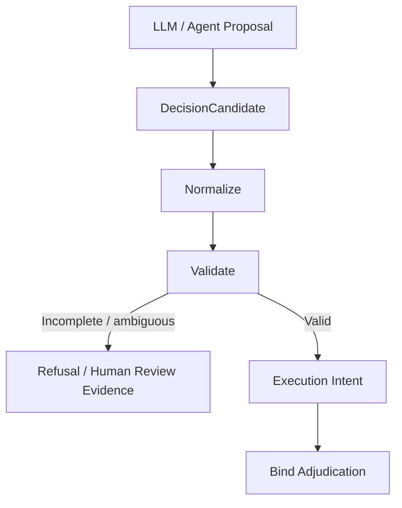

<div align="center">

# VERITAS OS v2.0

### AIエージェント向け Decision Governance / Bind-Boundary Control Plane

**AIが提案したアクションを、現実世界の effect にしてよいかを実行直前に統治する。**

[](https://doi.org/10.5281/zenodo.17838349)
[-10.5281%2Fzenodo.17838456-0E76A8?logo=doi&logoColor=white)](https://doi.org/10.5281/zenodo.17838456)
[-10.5281%2Fzenodo.22844531-0E76A8?logo=doi&logoColor=white)](https://doi.org/10.5281/zenodo.22844531)
[](https://zenodo.org/records/22844531)
[](https://www.python.org/downloads/)
[](https://nextjs.org/)
[-purple.svg)](LICENSE)
[](https://github.com/veritasfuji-japan/veritas_os/actions/workflows/main.yml)
[](https://github.com/veritasfuji-japan/veritas_os/actions/workflows/release-gate.yml)
[](https://github.com/veritasfuji-japan/veritas_os/actions/workflows/codeql.yml)
[](https://github.com/veritasfuji-japan/veritas_os/actions/workflows/publish-ghcr.yml)
[](docs/ja/validation/coverage-report.md)
[](https://ghcr.io/veritasfuji-japan/veritas_os)
[](README.md)
[](https://www.linkedin.com/in/takeshi-fujishita-279709392?utm_source=share&utm_campaign=share_via&utm_content=profile&utm_medium=ios_app)

**[Website](https://veritas-website-navy.vercel.app/)** ·
**[Reviewer Entry Point](docs/REVIEWER_ENTRYPOINT.md)** ·
**[Implementation Matrix](docs/en/validation/current-implementation-matrix.md)** ·
**[Technical Proof Pack](docs/en/validation/technical-proof-pack.md)** ·
**[Execution Governance Paper](https://zenodo.org/records/22844531)**

</div>

---

> [!IMPORTANT]
> ### AIの知能と、実行権限は別物です。
> AIモデルが「このアクションを実行すべき」と判断しても、それだけでは実行許可にはなりません。VERITAS は、実行時点の authority、policy、human approval、evidence、current state を確認し、その提案が実行境界を越えてよいかを判定します。

VERITAS OS は **AIエージェント向け Decision Governance and Bind-Boundary Control Plane** です。

モデル出力をそのままツールや外部システムへ渡すのではなく、AI出力を **Decision Candidate** として扱い、明示的な governance / execution boundary を通過した場合のみ、現実世界への effect を許可します。

中心にある考え方はシンプルです。

> **Authorization at issuance ≠ permission at execution.**  
> **認可が発行されたことと、実行時点で実行してよいことは同じではない。**

---

## なぜ VERITAS が必要なのか

AIエージェントは、すでに次のような高影響アクションを準備・実行できるようになりつつあります。

- 支払い・金融オペレーション
- IAM / 権限変更
- 本番インフラ変更
- コンプライアンス / リスク判断
- 外部API呼び出し
- 顧客・業務ワークフローの変更

難しい問題は、単に

> *AIが何をすべきか判断できるか？*

ではありません。

本当に重要なのは、

> *組織がその判断を現実世界の effect にしてよいと認めるために、実行直前に何が真でなければならないか？*

です。

意思決定から実行までの間に、次のものは変化する可能性があります。

- actor の authority
- 適用 policy
- target / scope
- Human Approval の有効性
- execution credential
- authorization の消費状態
- 外部システムの状態
- 以前の effect が既に発生したかどうかの確実性

VERITAS は、この **decision と execution の間**を統治します。

---

## アーキテクチャ概要

```mermaid
flowchart LR
    A["AI / Agent"] --> B["Decision Candidate"]
    B --> C["Governance Evaluation"]
    C --> D["Authority · Policy · Approval · Evidence"]
    D --> E["Execution Authorization"]
    E --> F["Single-Use Consumption"]
    F --> G["Bind Boundary"]
    G --> H["External Effect"]
    H --> I["Receipt / Outcome"]
    I --> J["Read-Only Reconciliation"]
    J --> K["Reviewer Evidence"]
```



| 実行前 | 実行境界 | 実行後 |
|---|---|---|
| Authority を確認 | 現在の governance を再検証 | Outcome を記録 |
| Policy を適用 | Authorization を一度だけ消費 | Evidence を保存 |
| Human Approval を拘束 | exact target / credential を解決 | 不確実な effect を照合 |
| Evidence を検証 | 不明確なら fail closed | Reviewer が検証可能にする |

### Mental model

```text
AI / Agent
   proposes
      ↓
VERITAS
   governs
      ↓
Bind Boundary
   permits or blocks
      ↓
External System
   produces an effect
      ↓
VERITAS
   records and reconciles evidence
```

---

## Core execution invariants

VERITAS は、実行ガバナンスに関する明示的な invariants を中心に設計されています。

| Invariant | 意味 |
|---|---|
| **AI output is a proposal** | モデル出力そのものは execution authority ではありません。 |
| **Authorization is contextual** | Authorization は action / target / scope / governance state に拘束されます。 |
| **Approval is not reusable permission** | Human Approval は汎用的な実行権限にはなりません。 |
| **Authorization is single-use** | 一度消費された authorization を別の effect に再利用できません。 |
| **Current state matters** | Effect の直前に governance 条件を再検証します。 |
| **Ambiguity fails closed** | Missing / stale / invalid / indeterminate な evidence は黙って通しません。 |
| **`EFFECT_UNKNOWN` is explicit** | 応答喪失を自動的に「実行失敗」とみなしません。 |
| **Blind re-dispatch is prohibited** | Effect が未解決なら、むやみに再送せず reconciliation を行います。 |
| **Reconciliation is read-only** | Effect の確認自体が新しい effect を起こしてはいけません。 |
| **Receipts are evidence, not authority** | Receipt は retrospective evidence であり、新しい実行権限ではありません。 |

---

# 実証済みのもの

## Controlled Decision-to-Effect E2E

VERITAS には、現在の main 相当コードに対して再現可能な **Decision-to-Effect E2E proof path** があります。

```text
/v1/decide
    ↓
Canonical Decision Artifact
    ↓
Verified Promotion
    ↓
Native v2 Authorization
    ↓
Single-Use Consumption
    ↓
Current Governance Rechecks
    ↓
TLS POST
    ↓
PostgreSQL Persistence
    ↓
Read-Only Reconciliation
    ↓
BindReceipt / Outcome
```

専用 proof path では以下を使用します。

- 実 TLS transport
- 実 PostgreSQL persistence
- durable authorization-consumption record
- dispatch 前の current governance recheck
- deterministic decision / authorization / receipt lineage
- read-only reconciliation
- machine-readable proof artifacts
- CIで検証対象となった exact commit identity

一方で、business decision、credential、external effect は **controlled synthetic fixtures** です。

### Normal path

通常シナリオでは、次の一連の流れを確認します。

**Decision → Promotion → Authorization → Consumption → Revalidation → External Effect → Reconciliation → Receipt / Outcome**

定義された execution boundary を迂回せず、governed action が effect と evidence までつながることを確認します。

### Lost-response fault path

より重要なのは、応答喪失ケースです。

```text
External system commits the effect
              ↓
Caller loses the response
              ↓
        EFFECT_UNKNOWN
              ↓
        No blind retry
              ↓
     Read-only reconciliation
              ↓
      Original effect confirmed
```

ここでは、

- **レスポンスを観測できなかった**
- **外部 effect が発生していないことが証明された**

を明確に区別します。

Effect が未解決の間、VERITAS は missing response を「もう一度同じ business event を送ってよい」という許可にはしません。

### Proof references

- [Reproducible Decision-to-Effect E2E Evidence](artifacts/real-decision-to-effect-e2e/README.md)
- [Controlled Execution Proof Architecture Freeze](docs/architecture/controlled-execution-proof-freeze-v1.json)
- [Reconciliation-Capable Execution Profile Proof](docs/en/validation/reconciliation-capable-execution-profile-proof-v1.md)
- [Runtime Proof CI Evidence](docs/en/guides/runtime-proof-ci-evidence.md)

> [!NOTE]
> Controlled proof の PASS は、その proof contract と tested commit に対する evidence です。すべての production property を証明するものではありません。

---

# この proof がまだ証明していないもの

VERITAS は **implemented proof** と **production claim** を意図的に分けています。

Controlled Decision-to-Effect proof だけでは、次のことは証明されません。

- すべての顧客環境での production readiness
- real customer credentials
- real customer endpoints
- live bank integration
- live IAM / IdP / SaaS integration
- external UTC clock trust
- production SLA
- regulatory approval
- compliance certification
- completed third-party audit
- すべての effect-bearing route に対する universal bind coverage

> [!CAUTION]
> **Repository に実装されていること**と、**顧客 production 環境で検証済みであること**は同じではありません。

正確な実装境界は次を参照してください。

**[Current Implementation Matrix](docs/en/validation/current-implementation-matrix.md)**

---

# 現在の実装

## Decision governance

`POST /v1/decide` は主要な structured decision path です。

Decision と後続の governance artifacts をつなぐ audit-facing lineage を提供します。

AIの decision そのものは external execution permission ではありません。

---

## LLM-to-Control-Plane boundary

VERITAS は「LLM自身に自分を統治させる」設計ではありません。



Incomplete / ambiguous な model output は、自動的に executable intent へ昇格しません。

See:

- [LLM-to-Control-Plane Contract](docs/en/architecture/llm-to-control-plane-contract.md)
- [External Reviewer Quickstart](docs/en/demo/external-reviewer-quickstart.md)

---

## Bind-boundary governance

VERITAS は実行 lineage を明示的な artifacts / transitions として扱います。

```text
Decision
   ↓
Execution Intent
   ↓
Authorization
   ↓
Consumption
   ↓
Bind Adjudication
   ↓
External Effect
   ↓
BindReceipt
   ↓
Outcome
```

Bind Boundary は、AIが提案したアクションが external side effect に変わる直前の最終 governance point です。

See:

- [Bind Boundary Governance Artifacts](docs/en/architecture/bind-boundary-governance-artifacts.md)
- [External Bind Integration Path](docs/en/guides/external-bind-integration-path.md)

---

## Bind-governed operator effects

Repository では、少なくとも以下の operator mutation path を bind-governed として明示しています。

```text
PUT  /v1/governance/policy
POST /v1/governance/policy-bundles/promote
PUT  /v1/compliance/config
POST /v1/system/halt
POST /v1/system/resume
```

これは明示的に文書化された subset です。

Relevant bind coverage docs / tests に含まれていない route まで自動的に bind-governed であるとは主張しません。

---

## Authority Evidence

VERITAS は governance decisions に対する structured Authority Evidence を扱います。

Authority evidence は、たとえば次の情報を表現できます。

- identity
- scope grants
- scope limitations
- validity / expiry
- provenance
- deterministic evidence hashes

Missing / invalid / expired / stale / indeterminate な Authority Evidence は fail closed にできます。

現在の repository には deterministic local/offline ingestion と validation pattern が含まれますが、すべての enterprise identity / banking / sanctions / customer authority source との live integration が完了したという意味ではありません。

See:

[Authority Evidence Ingestion](docs/en/architecture/authority-evidence-ingestion.md)

---

## Human Approval Receipt

Human Approval は単純な Boolean ではなく、structured governance artifact として扱われます。

Approval は次の要素へ拘束できます。

- specific action
- target
- scope
- decision context
- expiry
- verifier provenance

Secure / production posture では、local test compatibility state より強い verifier-derived provenance を要求できます。

Human Approval は unlimited reusable execution capability にはなりません。

See:

[Human Approval Receipt](docs/en/architecture/human-approval-receipt.md)

---

## Single-use authorization

VERITAS は durable single-use authorization-consumption semantics を実装しています。

狙いは次の invariant を維持することです。

```text
one valid decision
        +
one valid approval
        ↓
one contextual authorization
        ↓
one valid consumption
        ↓
one governed effect attempt
```

既に消費された authorization を、新しい execution authority として黙って再利用しません。

---

## Outcome Receipt

Outcome Receipt は governed action attempt に対する post-execution evidence です。

次のような情報を記録できます。

- observed outcome
- commit / block / rollback state
- postcondition status
- state fingerprints
- observed effects
- deterministic hashes

Outcome evidence は「何が観測されたか」を記録します。

新しい execution authority ではありません。

See:

[Outcome Receipt](docs/en/architecture/outcome-receipt.md)

---

## Evidence Chain / reviewer evidence

VERITAS には reviewer-facing evidence-chain capabilities が含まれます。

- deterministic hashes
- evidence manifests
- validation reports
- Reviewer Evidence Packets
- trusted-public-key provenance workflows
- Ed25519 verification paths
- reproducible handoff artifacts

Integrity と trust は意図的に分離されています。

Hash が一致したことは expected value に対する integrity を支えますが、その authority source や public key を信頼すべきことまで自動的に証明するわけではありません。

Start here:

- [Reviewer Evidence Index](docs/en/demo/reviewer-evidence-index.md)
- [Reviewer Evidence Assurance Overview](docs/en/demo/reviewer-evidence-assurance-overview.md)
- [Technical Proof Pack](docs/en/validation/technical-proof-pack.md)

---

## Mission Control

Mission Control は operator-facing governance surface です。

主に以下を可視化します。

- decisions
- governance state
- audit evidence
- policy workflows
- bind artifacts
- risk state
- system posture

Frontend stack:

- Next.js 16
- React
- TypeScript
- App Router

Mission Control は governance / review surface であり、UIそのものが execution authority の源泉ではありません。

---

# External execution integration

## WebhookBindAdapter

`WebhookBindAdapter` は external bind execution の最初の reference adapter です。

次の integration pattern を示します。

- governed action preparation
- target snapshot
- external HTTPS effect
- deterministic idempotency
- HMAC signing
- postcondition verification
- fail-closed behavior
- compensation semantics where supported
- bind receipts

See:

[WebhookBindAdapter](docs/en/guides/webhook-bind-adapter.md)

これは **reference integration pattern** です。

Production certification や completed customer deployment の証明ではありません。

---

## Minimal Python SDK

Minimal Python SDK reference:

[sdk/python/README.md](sdk/python/README.md)

SDK は VERITAS API を呼び出し、integration payload を準備するための補助です。

Execution boundary を迂回しません。

```text
SDK request
    ≠
permission for external side effect
```

---

# Regulated Action Governance

VERITAS には、次のような概念を扱う Regulated Action Governance kernel があります。

- Action Class Contract
- Authority Evidence
- Runtime Authority Validation
- Admissibility Predicate
- Human Approval
- Commit Boundary evaluation
- reviewer-facing evidence

See:

- [Regulated Action Governance Kernel](docs/en/architecture/regulated-action-governance-kernel.md)
- [Regulated Action Governance Proof Pack](docs/en/validation/regulated-action-governance-proof-pack.md)
- [Regulated Action Governance Quality Gate](docs/en/validation/regulated-action-governance-quality-gate.md)

---

# AML / KYC PoC

Repository には deterministic fixture-backed AML/KYC governance PoC が含まれています。

Start here:

- [AML/KYC 1-Day PoC Quickstart](docs/en/guides/poc-pack-financial-quickstart.md)
- [One-Day PoC Evidence Pack](docs/en/poc/one-day-poc-evidence-pack.md)
- [One-Day PoC Operator Runbook](docs/en/poc/one-day-poc-operator-runbook.md)
- [One-Day PoC Reviewer Handoff Template](docs/en/poc/one-day-poc-reviewer-handoff-template.md)

> [!WARNING]
> Fixture-backed AML/KYC evidence を live bank-side production integration として表現してはいけません。

---

# PostgreSQL / audit persistence

VERITAS は MemoryOS と TrustLog に pluggable persistence を採用しています。

| Environment | 推奨 backend |
|---|---|
| Local development | JSON / JSONL |
| Docker development | PostgreSQL |
| Staging | PostgreSQL |
| Secure / production path | PostgreSQL + environment-specific hardening |

PostgreSQL は、この repository で正式に文書化されている production storage path です。

主な repository capabilities:

- Alembic migrations
- PostgreSQL-backed MemoryOS
- PostgreSQL-backed TrustLog
- advisory-lock chain serialization
- JSONL → PostgreSQL migration tooling
- contention tests
- pool / health observability
- backup / restore / recovery drills

See:

- [PostgreSQL Production Guide](docs/en/operations/postgresql-production-guide.md)
- [PostgreSQL Drill Runbook](docs/en/operations/postgresql-drill-runbook.md)
- [Database Migrations](docs/en/operations/database-migrations.md)
- [PostgreSQL Production Proof Map](docs/en/validation/postgresql-production-proof-map.md)

Production guarantee は、実際の deployment infrastructure と operational control に依存します。

---

# Runtime posture

VERITAS は environment に応じた posture-aware behavior をサポートします。

```text
dev → staging → secure → prod
```

より強い posture では、次の項目に対して強い制約を要求できます。

- signing
- secret management
- approval provenance
- audit persistence
- replay behavior
- WORM storage
- trust evidence
- runtime configuration

See:

[Security Hardening](docs/en/operations/security-hardening.md)

---

# Quick start

## Requirements

- Python 3.11+
- 推奨 full-stack path では Docker / Docker Compose
- local frontend development では Node.js 20+
- default LLM configuration では OpenAI API key

## Docker Compose

```bash
git clone https://github.com/veritasfuji-japan/veritas_os.git
cd veritas_os
cp .env.example .env
```

必要な `CHANGE_ME` を置き換え、application / API / database / frontend authentication secrets を設定します。

起動:

```bash
docker compose up --build
```

| Component | Address |
|---|---|
| Mission Control | `http://localhost:3000` |
| API | `http://localhost:8000` |
| Swagger UI | `http://localhost:8000/docs` |
| PostgreSQL | `localhost:5432` |

停止:

```bash
docker compose down
```

Docker security configuration:

[Docker Compose Security](docs/en/operations/docker-compose-security.md)

---

## Local development

Install:

```bash
pip install -e ".[dev]"
cp .env.example .env
```

Backend:

```bash
make dev
```

Frontend:

```bash
make dev-frontend
```

Both:

```bash
make dev-all
```

---

## Decision API を試す

Open:

```text
http://127.0.0.1:8000/docs
```

設定済み API credential で authorize し、

```text
POST /v1/decide
```

を実行します。

Example:

```json
{
  "query": "Should I check tomorrow's weather before going out?",
  "context": {
    "user_id": "test_user",
    "goals": ["health", "efficiency"],
    "constraints": ["time limit"],
    "affect_hint": "focused"
  }
}
```

`/v1/decide` は governed decision result を生成します。

それ自体が external side effect を許可するわけではありません。

---

# Validation / CI

## Backend tests

```bash
pytest -q
```

Production-like validation:

```bash
make test-production
```

PostgreSQL smoke validation:

```bash
VERITAS_MEMORY_BACKEND=postgresql \
VERITAS_TRUSTLOG_BACKEND=postgresql \
pytest -m smoke veritas_os/tests/ -q
```

## CI / release evidence

Repository には次の領域をカバーする workflows があります。

- core CI
- CodeQL
- release gates
- security checks
- reviewer evidence validation
- reproducible Decision-to-Effect proof
- PostgreSQL-backed validation
- release evidence generation

Green workflow は、その workflow の **scope** に従って解釈する必要があります。

Focused proof の PASS は、その proof contract の evidence であり、すべての deployment property の blanket certification ではありません。

See:

[Operational Readiness Runbook](docs/en/operations/operational-readiness-runbook.md)

---

# Reviewer向け最短ルート

VERITAS を評価するために、repository 全体を読む必要はありません。

## 10分レビュー

1. **[README 日本語版](README_JP.md)** — product / execution boundary の概要
2. **[Reviewer Entry Point](docs/REVIEWER_ENTRYPOINT.md)** — guided review path
3. **[Current Implementation Matrix](docs/en/validation/current-implementation-matrix.md)** — implemented / partial / roadmap の分離
4. **[Decision-to-Effect E2E Evidence](artifacts/real-decision-to-effect-e2e/README.md)** — controlled execution proof
5. **[Technical Proof Pack](docs/en/validation/technical-proof-pack.md)** — reviewer checklist / proof assets

## より深い technical review

- [Regulated Action Governance Kernel](docs/en/architecture/regulated-action-governance-kernel.md)
- [External Bind Integration Path](docs/en/guides/external-bind-integration-path.md)
- [External Bind PoC Evidence](docs/en/guides/external-bind-poc-evidence.md)
- [Reconciliation-Capable Execution Profile Proof](docs/en/validation/reconciliation-capable-execution-profile-proof-v1.md)
- [External Audit Readiness](docs/en/validation/external-audit-readiness.md)
- [Validation Evidence Map](docs/en/validation/validation-evidence-map.md)

---

# 現在の実装境界

詳細な truth table:

**[Current Implementation Matrix](docs/en/validation/current-implementation-matrix.md)**

High-level summary:

| Area | Current repository status |
|---|---|
| Core decision pipeline | Implemented |
| Bind-boundary governance | Implemented / partial route coverage |
| Selected operator effect paths | Explicitly bind-governed |
| Authority Evidence | Implemented / bounded |
| Human Approval Receipt | Implemented / bounded |
| Single-use authorization | Implemented in controlled execution path |
| Outcome Receipt | Implemented |
| Evidence Chain | Implemented |
| Mission Control | Implemented |
| PostgreSQL production path | Implemented / environment dependent |
| Controlled Decision-to-Effect E2E | Implemented |
| AML/KYC fixture PoC | Implemented |
| Live customer integrations | Integration / environment dependent |
| Completed third-party certification | Not claimed |

---

# VERITAS が「何ではないか」

VERITAS は次のものではありません。

- LLM自身に「安全か」を判断させる仕組み
- prompt-only guardrail
- IAM の代替
- KMS / HSM infrastructure の代替
- organizational policy の代替
- すべての model output が正しいことの証明
- すべての external system が信頼できることの証明
- 法的助言
- regulatory approval
- automatic production certification

VERITAS の役割はより限定的で、具体的です。

> **AIが提案したアクションを、実行時点の evidence と governance state のもとで execution boundary を越えてよいか判定すること。**

---

# Post-hoc audit との違い

従来の audit は、主に次を答えます。

> **何が起きたか？**

VERITAS は effect の **前** に、さらに次の問いを明示します。

| Question | Governance concern |
|---|---|
| 誰に authority があるか？ | Authority |
| どの policy が適用されるか？ | Admissibility |
| Human は何を正確に承認したか？ | Approval binding |
| Approval はまだ有効か？ | Freshness / expiry |
| Approval 後に material change はないか？ | Execution-time revalidation |
| Authorization は既に消費されていないか？ | Replay prevention |
| 実行対象は正しいか？ | Target / scope integrity |
| 現在の evidence で action を許可できるか？ | Bind adjudication |

そして effect の **後** には、

| Question | Evidence concern |
|---|---|
| 何が観測されたか？ | Outcome |
| 何がその観測を支えるか？ | Receipt / evidence chain |
| Response が失われたのか？ | `EFFECT_UNKNOWN` |
| 再実行せず effect を確認できるか？ | Read-only reconciliation |
| Reviewer が lineage を追えるか？ | Reviewer evidence |

を扱います。

---

# Research

VERITAS では、system architecture と execution governance を別の publication として公開しています。

### System architecture

**VERITAS OS: Auditable Decision OS for LLM Agents**

[DOI: 10.5281/zenodo.17838349](https://doi.org/10.5281/zenodo.17838349)

日本語版:

[DOI: 10.5281/zenodo.17838456](https://doi.org/10.5281/zenodo.17838456)

### Execution governance

**VERITAS OS: From Authorization to Verified External Effect in AI Agent Execution Governance**

- [DOI: 10.5281/zenodo.22844531](https://doi.org/10.5281/zenodo.22844531)
- [Zenodo Record 22844531](https://zenodo.org/records/22844531)

Execution Governance paper の主なテーマ:

- execution-time revalidation
- single-use authorization consumption
- explicit `EFFECT_UNKNOWN`
- reconciliation-capability gating
- read-only reconciliation
- controlled reproducible evidence

---

# Documentation map

## Start here

- [Reviewer Entry Point](docs/REVIEWER_ENTRYPOINT.md)
- [Current Implementation Matrix](docs/en/validation/current-implementation-matrix.md)
- [Enterprise Value Brief](docs/en/positioning/enterprise-value-brief.md)
- [Technical Proof Pack](docs/en/validation/technical-proof-pack.md)

## Execution governance

- [External Bind Integration Path](docs/en/guides/external-bind-integration-path.md)
- [WebhookBindAdapter](docs/en/guides/webhook-bind-adapter.md)
- [External Bind PoC Evidence](docs/en/guides/external-bind-poc-evidence.md)
- [Reconciliation-Capable Execution Profile Proof](docs/en/validation/reconciliation-capable-execution-profile-proof-v1.md)

## Reviewer evidence

- [Reviewer Evidence Index](docs/en/demo/reviewer-evidence-index.md)
- [Reviewer Evidence Assurance Overview](docs/en/demo/reviewer-evidence-assurance-overview.md)
- [Reviewer Handoff Guide](docs/en/validation/reviewer-handoff-guide.md)
- [External Audit Readiness](docs/en/validation/external-audit-readiness.md)

## Operations

- [Operational Readiness Runbook](docs/en/operations/operational-readiness-runbook.md)
- [Security Hardening](docs/en/operations/security-hardening.md)
- [PostgreSQL Production Guide](docs/en/operations/postgresql-production-guide.md)
- [Provider Support Matrix](docs/en/operations/provider-support-matrix.md)

## PoC

- [One-Day PoC Reviewer Pack](docs/en/poc/one-day-poc-reviewer-pack.md)
- [One-Day PoC Evidence Pack](docs/en/poc/one-day-poc-evidence-pack.md)
- [AML/KYC Quickstart](docs/en/guides/poc-pack-financial-quickstart.md)

---

# Roadmap

Near-term work は、authorization から externally verified effect までの境界をさらに強くすることに集中しています。

Priority areas:

- broader bind coverage
- real external integration validation
- customer-specific authority-source integration
- credential-resolution hardening
- stronger external-reality authenticity
- clock-trust hardening
- reconciliation across additional effect classes
- production customer workflow validation
- independent external review
- continued benchmark / adversarial evaluation

Roadmap items を completed implementation として表現しません。

---

# License

この repository は directory-scoped multi-license model を採用しています。

| Scope | License | Commercial use |
|---|---|---|
| Core repository unless overridden | VERITAS Core Proprietary EULA | Contract required |
| `spec/` | MIT | Permitted |
| `sdk/` | MIT | Permitted |
| `cli/` | MIT | Permitted |
| `policies/examples/` | MIT | Permitted |

See:

- [LICENSE](LICENSE)
- [NOTICE](NOTICE)
- [TRADEMARKS](TRADEMARKS)

---

# Contributing

[CONTRIBUTING.md](CONTRIBUTING.md) を参照してください。

Security issue は [SECURITY.md](SECURITY.md) に従って報告してください。

---

# Citation

```bibtex
@software{veritas_os_2025,
  author = {Fujishita, Takeshi},
  title  = {VERITAS OS: Auditable Decision OS for LLM Agents},
  year   = {2025},
  doi    = {10.5281/zenodo.17838349},
  url    = {https://github.com/veritasfuji-japan/veritas_os}
}
```

---

# Contact

**Takeshi Fujishita**

- GitHub Issues: https://github.com/veritasfuji-japan/veritas_os/issues
- Email: veritas.fuji@gmail.com
- LinkedIn: https://www.linkedin.com/in/takeshi-fujishita-279709392

---

<div align="center">

## Core rule

### AIはアクションを提案できます。自分自身に実行権限を与えることはできません。

VERITAS は **decision / authority / execution / effect / evidence** を分離して扱います。

そして external effect の attempt 後には、

### 応答がないことは、「何も起きなかった」ことの証明ではありません。

</div>
