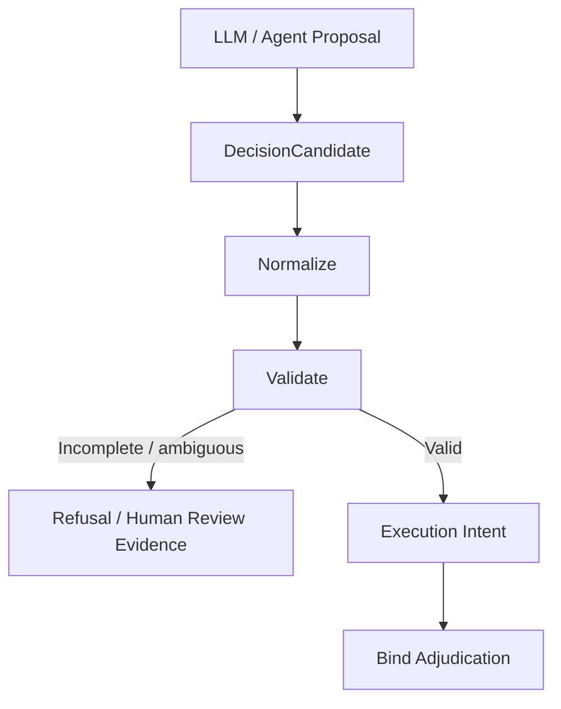

<div align="center">

# VERITAS OS v2.0

### AIエージェント向け意思決定ガバナンス / Bind-Boundary Control Plane

**AIが提案したアクションを、現実世界で実行してよいかを、実行直前に検証・統制する。**

[](https://doi.org/10.5281/zenodo.17838349)
[-10.5281%2Fzenodo.17838456-0E76A8?logo=doi&logoColor=white)](https://doi.org/10.5281/zenodo.17838456)
[-10.5281%2Fzenodo.22844531-0E76A8?logo=doi&logoColor=white)](https://doi.org/10.5281/zenodo.22844531)
[](https://zenodo.org/records/22844531)
[](https://www.python.org/downloads/)
[](https://nextjs.org/)
[-purple.svg)](LICENSE)
[](https://github.com/veritasfuji-japan/veritas_os/actions/workflows/main.yml)
[](https://github.com/veritasfuji-japan/veritas_os/actions/workflows/release-gate.yml)
[](https://github.com/veritasfuji-japan/veritas_os/actions/workflows/codeql.yml)
[](https://github.com/veritasfuji-japan/veritas_os/actions/workflows/publish-ghcr.yml)
[](docs/ja/validation/coverage-report.md)
[](https://ghcr.io/veritasfuji-japan/veritas_os)
[](README.md)
[](https://www.linkedin.com/in/takeshi-fujishita-279709392?utm_source=share&utm_campaign=share_via&utm_content=profile&utm_medium=ios_app)

**[Website](https://veritas-website-navy.vercel.app/)** ·
**[Reviewer Entry Point](docs/REVIEWER_ENTRYPOINT.md)** ·
**[Implementation Matrix](docs/en/validation/current-implementation-matrix.md)** ·
**[Technical Proof Pack](docs/ja/validation/technical-proof-pack.md)** ·
**[Execution Governance Paper](https://zenodo.org/records/22844531)**

</div>

**Version**: 2.0.0  
**Release Status**: ベータ版  
**Author**: Takeshi Fujishita

---

> [!IMPORTANT]
> ### AIが判断できることと、実行する権限を持つことは別です。
> AIモデルが「このアクションを実行すべき」と判断しても、それだけでは実行許可にはなりません。VERITAS は、実行時点の権限、ポリシー、人間承認、証拠、現在の状態を確認し、その提案が実行境界を越えてよいかを判定します。

VERITAS OS は、**AIエージェント向けの意思決定ガバナンス / Bind-Boundary Control Plane** です。

モデル出力をそのままツールや外部システムへ渡すのではなく、AI出力を **Decision Candidate** として扱い、明示的なガバナンス境界と実行境界を通過した場合にのみ、現実世界での実行を許可します。

中心にある考え方はシンプルです。

> **Authorization at issuance ≠ permission at execution.**  
> **認可が発行されたことと、実行時点で実行してよいことは同じではありません。**

> [!NOTE]
> VERITAS OS は現在、公開上 **ベータ品質のガバナンス基盤** として位置づけています。リポジトリ上で実装・検証済みの機能と、顧客本番環境での検証、第三者認証、規制当局による承認は明確に区別します。

---

## なぜ VERITAS が必要なのか

AIエージェントは、すでに次のような影響の大きいアクションを準備・実行できるようになりつつあります。

- 支払い・金融オペレーション
- IAM / 権限変更
- 本番インフラ変更
- コンプライアンス / リスク判断
- 外部API呼び出し
- 顧客・業務ワークフローの変更

難しい問題は、単に

> *AIが何をすべきか判断できるか？*

ではありません。

本当に重要なのは、

> *組織がその判断を現実世界で実行してよいと認めるために、実行直前にどの条件が満たされている必要があるか？*

です。

意思決定から実行までの間に、次のものは変化する可能性があります。

- 実行主体の権限
- 適用されるポリシー
- 実行対象 / スコープ
- Human Approval（人間承認）の有効性
- 実行時に使う認証情報
- Authorization の消費状態
- 外部システムの状態
- 以前の外部作用がすでに発生したかどうかの確実性

VERITAS は、この **意思決定と実行の間**を統治します。

---

## アーキテクチャ概要

```mermaid
flowchart LR
    A["AI / Agent"] --> B["Decision Candidate"]
    B --> C["Governance Evaluation"]
    C --> D["Authority · Policy · Approval · Evidence"]
    D --> E["Execution Authorization"]
    E --> F["Single-Use Consumption"]
    F --> G["Bind Boundary"]
    G --> H["External Effect"]
    H --> I["Receipt / Outcome"]
    I --> J["Read-Only Reconciliation"]
    J --> K["Reviewer Evidence"]
```



| 実行前 | 実行境界 | 実行後 |
|---|---|---|
| 権限を確認 | 現在のガバナンス状態を再検証 | Outcome を記録 |
| ポリシーを適用 | Authorization を一度だけ消費 | Evidence を保存 |
| Human Approval を対象・条件に拘束 | 実行対象と認証情報を確定 | 不確実な外部作用を照合 |
| 証拠を検証 | 不明確なら fail closed | レビュー担当者が検証できる形で残す |

### 基本イメージ

```text
AI / Agent
   proposes
      ↓
VERITAS
   governs
      ↓
Bind Boundary
   permits or blocks
      ↓
External System
   produces an effect
      ↓
VERITAS
   records and reconciles evidence
```

---

## 実行ガバナンスの基本原則

VERITAS は、実行ガバナンスに関する明示的な不変条件を中心に設計されています。

| Invariant | 意味 |
|---|---|
| **AI output is a proposal** | モデル出力そのものは実行権限ではありません。 |
| **Authorization is contextual** | Authorization は、アクション・実行対象・スコープ・ガバナンス状態に拘束されます。 |
| **Approval is not reusable permission** | Human Approval は汎用的な実行権限にはなりません。 |
| **Authorization is single-use** | 一度消費された Authorization を別の実行に再利用できません。 |
| **Current state matters** | 外部作用の直前にガバナンス条件を再検証します。 |
| **Ambiguity fails closed** | 証拠が欠落・古い・無効・判定不能な場合は、黙って通しません。 |
| **`EFFECT_UNKNOWN` is explicit** | 応答喪失を自動的に「実行失敗」とみなしません。 |
| **Blind re-dispatch is prohibited** | 外部作用が未解決なら、むやみに再送せず Reconciliation（照合）を行います。 |
| **Reconciliation is read-only** | 外部作用の確認そのものが、新たな外部作用を起こしてはいけません。 |
| **Receipts are evidence, not authority** | Receipt は事後証拠であり、新しい実行権限ではありません。 |

---

### 拡張時に重要な責務境界

VERITAS の内部コンポーネントは責務を分離しています。機能追加時も、判断・安全判定・計画・記憶管理の境界を不用意に混在させないことが重要です。

| コンポーネント | 主な責務 | 境界 |
|---|---|---|
| **Planner** | 計画構造、アクションプラン生成、Planner向け要約 | Kernel の意思決定オーケストレーション、FUJI の安全ポリシー、MemoryOS の永続化責務を持ち込まない |
| **Kernel** | 意思決定計算、スコアリング、根拠構築、各ステージの接続 | API運用、永続化、ガバナンス保存処理を直接抱え込まない |
| **FUJI** | 最終安全・ポリシー判定、拒否セマンティクス、監査向けゲート状態 | Planner の計画判断や MemoryOS の管理責務を持ち込まない |
| **MemoryOS** | 保存、検索、要約、ライフサイクル、セキュリティ制御 | Planner / Kernel の意思決定方針や FUJI のゲート判定を担わない |

この責務分離は、ガバナンス境界をレビュー可能・テスト可能な状態に保つための設計上の前提です。

# 実証済みのもの

## Controlled Decision-to-Effect E2E

VERITAS には、現在の main 相当のコードで再現できる **Decision-to-Effect E2E の証明経路**があります。

```text
/v1/decide
    ↓
Canonical Decision Artifact
    ↓
Verified Promotion
    ↓
Native v2 Authorization
    ↓
Single-Use Consumption
    ↓
Current Governance Rechecks
    ↓
TLS POST
    ↓
PostgreSQL Persistence
    ↓
Read-Only Reconciliation
    ↓
BindReceipt / Outcome
```

専用の証明経路では、以下を実際に使用します。

- 実際のTLS通信
- 実際のPostgreSQLへの永続化
- 永続化された Authorization 消費記録
- dispatch 前の現在ガバナンス状態の再検証
- 決定論的な Decision / Authorization / Receipt の系譜
- read-only の Reconciliation
- 機械可読な証明アーティファクト
- CIで実際に検証されたコミットの厳密な識別情報

一方で、業務上の判断内容、認証情報、外部作用は **controlled synthetic fixtures（制御された合成フィクスチャ）** です。

### 通常系

通常シナリオでは、次の一連の流れを確認します。

**Decision → Promotion → Authorization → Consumption → Revalidation → External Effect → Reconciliation → Receipt / Outcome**

定義された実行境界を迂回せず、統制されたアクションが外部作用と証拠まで一貫してつながることを確認します。

### 応答喪失時の異常系

より重要なのは、応答喪失ケースです。

```text
External system commits the effect
              ↓
Caller loses the response
              ↓
        EFFECT_UNKNOWN
              ↓
        No blind retry
              ↓
     Read-only reconciliation
              ↓
      Original effect confirmed
```

ここでは、

- **レスポンスを観測できなかった**
- **外部作用が発生していないことが証明された**

を明確に区別します。

外部作用が未解決の間、VERITAS は応答の欠落を「もう一度同じ業務イベントを送ってよい」という許可にはしません。

### 証明資料

- [Reproducible Decision-to-Effect E2E Evidence](artifacts/real-decision-to-effect-e2e/README.md)
- [Controlled Execution Proof Architecture Freeze](docs/architecture/controlled-execution-proof-freeze-v1.json)
- [Reconciliation-Capable Execution Profile Proof](docs/en/validation/reconciliation-capable-execution-profile-proof-v1.md)
- [Runtime Proof CI Evidence](docs/en/guides/runtime-proof-ci-evidence.md)

> [!NOTE]
> Controlled proof の PASS は、その証明条件と検証対象コミットに対する証拠です。本番環境に関するすべての性質や保証を証明するものではありません。

---

# この証明でまだ確認していないこと

VERITAS は、**リポジトリ上で実証したこと**と**本番環境について主張できること**を意図的に分けています。

Controlled Decision-to-Effect の証明だけでは、次のことまでは証明されません。

- すべての顧客環境における本番運用準備の完了
- 実顧客の認証情報
- 実顧客のエンドポイント
- 銀行システムとのライブ統合
- IAM / IdP / SaaS とのライブ統合
- 外部UTC時刻源への信頼
- 本番SLA
- 規制当局による承認
- コンプライアンス認証
- 完了済みの第三者監査
- すべての外部作用を伴うルートに対する完全な Bind Coverage

> [!CAUTION]
> **リポジトリに実装されていること**と、**顧客の本番環境で検証済みであること**は同じではありません。

正確な実装境界は次を参照してください。

**[Current Implementation Matrix](docs/en/validation/current-implementation-matrix.md)**

---

# 現在の実装

## 意思決定ガバナンス

`POST /v1/decide` は主要な構造化意思決定パスです。

Decision と後続のガバナンスアーティファクトをつなぐ、監査向けの系譜を提供します。

AIの意思決定そのものは、外部システムを実行する許可ではありません。

---

## LLM-to-Control-Plane 境界

VERITAS は「LLM自身に自分を統治させる」設計ではありません。



不完全または曖昧なモデル出力は、自動的に実行可能な intent へ昇格しません。

参照:

- [LLM-to-Control-Plane Contract](docs/en/architecture/llm-to-control-plane-contract.md)
- [External Reviewer Quickstart](docs/en/demo/external-reviewer-quickstart.md)

---

## Bind Boundary ガバナンス

VERITAS は、実行の系譜を明示的なアーティファクトと状態遷移として扱います。

```text
Decision
   ↓
Execution Intent
   ↓
Authorization
   ↓
Consumption
   ↓
Bind Adjudication
   ↓
External Effect
   ↓
BindReceipt
   ↓
Outcome
```

Bind Boundary は、AIが提案したアクションが外部システムへの作用に変わる直前にある、最後のガバナンス境界です。

参照:

- [Bind Boundary Governance Artifacts](docs/ja/architecture/bind-boundary-governance-artifacts.md)
- [External Bind Integration Path](docs/en/guides/external-bind-integration-path.md)

---

## Bind で統制されるオペレーター操作

リポジトリでは、少なくとも以下のオペレーターによる変更操作を Bind で統制する対象として明示しています。

```text
PUT /v1/governance/policy
POST /v1/governance/policy-bundles/promote
PUT /v1/compliance/config
POST /v1/system/halt
POST /v1/system/resume
```

これは、明示的に文書化された対象範囲です。

Bind Coverage の文書やテストで確認されていないルートまで、自動的に Bind で統制されているとは主張しません。

---

## Authority Evidence

VERITAS は、ガバナンス判断に利用する構造化された Authority Evidence を扱います。

Authority Evidence は、たとえば次の情報を表現できます。

- identity
- scope grants
- scope limitations
- validity / expiry
- provenance
- 決定論的な evidence hash

Authority Evidence が欠落・無効・期限切れ・古い・判定不能な場合は、fail closed にできます。

現在のリポジトリには決定論的なローカル / オフラインの取り込み・検証パターンが含まれますが、すべての企業ID基盤、銀行、制裁情報、顧客側の権限情報源とのライブ統合が完了しているという意味ではありません。

参照:

[Authority Evidence Ingestion](docs/en/architecture/authority-evidence-ingestion.md)

---

## Human Approval Receipt

Human Approval は単純な真偽値ではなく、構造化されたガバナンスアーティファクトとして扱われます。

Approval は次の要素に拘束できます。

- specific action
- target
- scope
- decision context
- expiry
- verifier provenance

secure / prod posture では、ローカルテスト用の互換状態よりも強い、検証器に基づく provenance を要求できます。

Human Approval が、無制限に再利用できる実行権限になることはありません。

参照:

[Human Approval Receipt](docs/en/architecture/human-approval-receipt.md)

---

## Single-use authorization

VERITAS は、永続化された Single-Use Authorization Consumption のセマンティクスを実装しています。

目的は、次の不変条件を維持することです。

```text
one valid decision
        +
one valid approval
        ↓
one contextual authorization
        ↓
one valid consumption
        ↓
one governed effect attempt
```

すでに消費された Authorization を、新しい実行権限として黙って再利用しません。

---

## Outcome Receipt

Outcome Receipt は、統制された実行試行に対する事後証拠です。

次のような情報を記録できます。

- observed outcome
- commit / block / rollback state
- postcondition status
- state fingerprints
- observed effects
- deterministic hashes

Outcome evidence は「何が観測されたか」を記録するものです。

新しい実行権限ではありません。

参照:

[Outcome Receipt](docs/en/architecture/outcome-receipt.md)

---

## Evidence Chain / Reviewer Evidence

VERITAS には、レビュー担当者が確認できる Evidence Chain の機能が含まれます。

- deterministic hashes
- evidence manifests
- validation reports
- Reviewer Evidence Packets
- trusted-public-key provenance workflows
- Ed25519 verification paths
- reproducible handoff artifacts

Integrity（完全性）と trust（信頼）は意図的に分離されています。

Hash の一致は expected value に対する integrity（完全性）の確認を支えますが、その authority source や public key 自体を信頼すべきことまで自動的に証明するわけではありません。

最初に読む資料:

- [Reviewer Evidence Index](docs/en/demo/reviewer-evidence-index.md)
- [Reviewer Evidence Assurance Overview](docs/en/demo/reviewer-evidence-assurance-overview.md)
- [Technical Proof Pack](docs/ja/validation/technical-proof-pack.md)

---

## Mission Control

Mission Control は、オペレーター向けのガバナンス画面です。

主に以下を確認できます。

- decisions
- governance state
- audit evidence
- policy workflows
- bind artifacts
- risk state
- system posture

フロントエンド:

- Next.js 16
- React
- TypeScript
- App Router

Mission Control はガバナンスとレビューのための画面であり、UIそのものが実行権限の根拠になるわけではありません。

---

# 外部実行との統合

## WebhookBindAdapter

`WebhookBindAdapter` は、外部実行を Bind Boundary で統制するための最初のリファレンスアダプターです。

次の統合パターンを示します。

- 統制対象アクションの準備
- target snapshot
- 外部HTTPS effect
- deterministic idempotency
- HMAC signing
- postcondition verification
- fail-closed behavior
- 対応可能な場合の compensation semantics
- bind receipts

参照:

[WebhookBindAdapter](docs/en/guides/webhook-bind-adapter.md)

これは **リファレンス実装としての統合パターン**です。

本番認証や、完了済みの顧客導入を証明するものではありません。

---

## Minimal Python SDK

Minimal Python SDK:

[sdk/python/README.md](sdk/python/README.md)

SDK は VERITAS API を呼び出し、統合用 payload を準備するための補助です。

実行境界を迂回するものではありません。

```text
SDK request
    ≠
permission for external side effect
```

---

# Regulated Action Governance

VERITAS には、次の概念を扱う **Regulated Action Governance Kernel** があります。

- Action Class Contract
- Authority Evidence
- Runtime Authority Validation
- Admissibility Predicate
- Human Approval
- Irreversible Commit Boundary
- reviewer-facing evidence

選択された regulated action path では、execution intent を Bind Boundary で `commit / block / escalate / refuse` のいずれにするかを判定します。

参照:

- [Regulated Action Governance Kernel（英語正本）](docs/en/architecture/regulated-action-governance-kernel.md)
- [Authority Evidence vs Audit Log（英語正本）](docs/en/architecture/authority-evidence-vs-audit-log.md)
- [AML/KYC Regulated Action Path（英語正本）](docs/en/use-cases/aml-kyc-regulated-action-path.md)
- [Regulated Action Governance Proof Pack（英語正本）](docs/en/validation/regulated-action-governance-proof-pack.md)
- [Regulated Action Governance Quality Gate（英語正本）](docs/en/validation/regulated-action-governance-quality-gate.md)

---

# AML / KYC PoC

リポジトリには、決定論的な fixture-backed（フィクスチャに基づく）AML/KYC governance PoC が含まれています。

最初に読む資料:

- [AML/KYC 1-Day PoC Quickstart](docs/ja/guides/poc-pack-financial-quickstart.md)
- [One-Day PoC Evidence Pack](docs/en/poc/one-day-poc-evidence-pack.md)
- [One-Day PoC Operator Runbook](docs/en/poc/one-day-poc-operator-runbook.md)
- [One-Day PoC Reviewer Handoff Template](docs/en/poc/one-day-poc-reviewer-handoff-template.md)

> [!WARNING]
> Fixture-backed の AML/KYC evidence を、銀行システムとの本番ライブ統合として表現してはいけません。

AML/KYC customer risk escalation fixture は、regulated-action governance の挙動を確認するための決定論的な engineering fixture です。

**Audit Log と Authority Evidence の違い:** Audit Log は「何が起きたか」を記録します。Authority Evidence は、Bind 時点で「なぜそのアクションが authorized / admissible だったか」を示す証拠です。Audit Log だけでは commit を許可しません。

> [!NOTE]
> 本READMEは法的助言ではありません。規制当局の承認や第三者認証を示すものでもありません。リポジトリ上の evidence や controlled proof を、コンプライアンス認証や顧客本番環境での検証完了として解釈しないでください。

---

# PostgreSQL / 監査データの永続化

VERITAS は MemoryOS と TrustLog に、切り替え可能な永続化バックエンドを採用しています。

| Environment | 推奨 backend |
|---|---|
| Local development | JSON / JSONL |
| Docker development | PostgreSQL |
| Staging | PostgreSQL |
| Secure / production path | PostgreSQL + environment-specific hardening |

PostgreSQL は、このリポジトリで正式に文書化されている本番向けストレージ経路です。

主な機能:

- Alembic migrations
- PostgreSQL-backed MemoryOS
- PostgreSQL-backed TrustLog
- advisory-lock chain serialization
- JSONL → PostgreSQL migration tooling
- contention tests
- pool / health observability
- backup / restore / recovery drills

参照:

- [PostgreSQL Production Guide](docs/ja/operations/postgresql-production-guide.md)
- [PostgreSQL Drill Runbook](docs/ja/operations/postgresql-drill-runbook.md)
- [Database Migrations](docs/ja/operations/database-migrations.md)
- [PostgreSQL Production Proof Map](docs/en/validation/postgresql-production-proof-map.md)

本番環境での保証内容は、実際のデプロイ基盤と運用上の統制に依存します。

---

# Runtime posture

VERITAS は、環境に応じて動作を切り替える posture-aware な制御をサポートします。

```text
dev → staging → secure → prod
```

より厳格な posture では、次の項目により強い制約を要求できます。

- signing
- secret management
- approval provenance
- audit persistence
- replay behavior
- WORM storage
- trust evidence
- runtime configuration

参照:

[Security Hardening](docs/ja/operations/security-hardening.md)

---

# クイックスタート

## 必要環境

- Python 3.11+
- 推奨のフルスタック構成では Docker / Docker Compose
- ローカルでフロントエンドを開発する場合は Node.js 20+
- 既定のLLM構成では OpenAI API key

## Docker Compose

```bash
git clone https://github.com/veritasfuji-japan/veritas_os.git
cd veritas_os
cp .env.example .env
```

必要な `CHANGE_ME` を置き換え、アプリケーション、API、データベース、フロントエンド認証に必要なシークレットを設定します。

起動:

```bash
docker compose up --build
```

| Component | Address |
|---|---|
| Mission Control | `http://localhost:3000` |
| API | `http://localhost:8000` |
| Swagger UI | `http://localhost:8000/docs` |
| PostgreSQL | `localhost:5432` |

停止:

```bash
docker compose down
```

Docker のセキュリティ設定:

[Docker Compose Security](docs/en/operations/docker-compose-security.md)

---

## ローカル開発

インストール:

```bash
pip install -e ".[dev]"
cp .env.example .env
```

バックエンド:

```bash
make dev
```

フロントエンド:

```bash
make dev-frontend
```

両方を起動:

```bash
make dev-all
```

---

## Decision API を試す

ブラウザで開く:

```text
http://127.0.0.1:8000/docs
```

設定済みのAPI認証情報で認証し、

```text
POST /v1/decide
```

を実行します。

例:

```json
{
  "query": "Should I check tomorrow's weather before going out?",
  "context": {
    "user_id": "test_user",
    "goals": ["health", "efficiency"],
    "constraints": ["time limit"],
    "affect_hint": "focused"
  }
}
```

`/v1/decide` は、ガバナンスを通過した意思決定結果を生成します。

それ自体が外部システムへの作用を許可するわけではありません。

---

# 検証 / CI

## バックエンドテスト

```bash
pytest -q
```

本番相当の検証:

```bash
make test-production
```

PostgreSQL のスモーク検証:

```bash
VERITAS_MEMORY_BACKEND=postgresql \
VERITAS_TRUSTLOG_BACKEND=postgresql \
pytest -m smoke veritas_os/tests/ -q
```

## CI / リリース証拠

リポジトリには、次の領域をカバーするワークフローがあります。

- core CI
- CodeQL
- release gates
- security checks
- Reviewer Evidence の検証
- 再現可能な Decision-to-Effect proof
- PostgreSQL-backed validation
- リリース証拠の生成

ワークフローがGreenでも、その結果は各ワークフローの **検証範囲** に沿って解釈する必要があります。

特定範囲の証明がPASSしても、それは定義された証明条件に対する evidence であり、すべてのデプロイ特性に対する包括的な認証ではありません。

参照:

[Operational Readiness Runbook](docs/en/operations/operational-readiness-runbook.md)

---

# Reviewer向け最短レビュー経路

VERITAS を評価するために、リポジトリ全体を読む必要はありません。

## 10分レビュー

1. **[README 日本語版](README_JP.md)** — 製品と実行境界の概要
2. **[Reviewer Entry Point](docs/REVIEWER_ENTRYPOINT.md)** — レビュー手順の案内
3. **[Current Implementation Matrix](docs/en/validation/current-implementation-matrix.md)** — 実装済み / 部分実装 / ロードマップの分離
4. **[Decision-to-Effect E2E Evidence](artifacts/real-decision-to-effect-e2e/README.md)** — controlled execution の証明
5. **[Technical Proof Pack](docs/ja/validation/technical-proof-pack.md)** — レビュー用チェックリスト / 証明資料

## より詳しい技術レビュー

- [Regulated Action Governance Kernel](docs/en/architecture/regulated-action-governance-kernel.md)
- [External Bind Integration Path](docs/en/guides/external-bind-integration-path.md)
- [External Bind PoC Evidence](docs/en/guides/external-bind-poc-evidence.md)
- [Reconciliation-Capable Execution Profile Proof](docs/en/validation/reconciliation-capable-execution-profile-proof-v1.md)
- [External Audit Readiness](docs/ja/validation/external-audit-readiness.md)
- [Validation Evidence Map](docs/en/validation/validation-evidence-map.md)

---

# 現在の実装境界

詳細な実装状況一覧:

**[Current Implementation Matrix](docs/en/validation/current-implementation-matrix.md)**

概要:

| 領域 | 現在の状態 |
|---|---|
| Core decision pipeline | 実装済み |
| Bind-boundary governance | 実装済み / 一部ルートをカバー |
| Selected operator effect paths | Bind で統制する対象として明示 |
| Authority Evidence | 実装済み / 適用範囲あり |
| Human Approval Receipt | 実装済み / 適用範囲あり |
| Single-use authorization | controlled execution path で実装済み |
| Outcome Receipt | 実装済み |
| Evidence Chain | 実装済み |
| Mission Control | 実装済み |
| PostgreSQL production path | 実装済み / 環境依存 |
| Controlled Decision-to-Effect E2E | 実装済み |
| AML/KYC fixture PoC | 実装済み |
| Live customer integrations | 統合先 / 環境に依存 |
| Completed third-party certification | 未主張 |

---

# VERITAS が担わないもの

VERITAS は次のものではありません。

- LLM自身に「安全か」を判断させる仕組み
- プロンプトだけに依存するガードレール
- IAM の代替
- KMS / HSM 基盤の代替
- 組織ポリシーの代替
- すべてのモデル出力が正しいことの証明
- すべての外部システムが信頼できることの証明
- 法的助言
- 規制当局による承認
- 自動的な本番認証

VERITAS の役割はより限定的で、具体的です。

> **AIが提案したアクションを、実行時点の証拠とガバナンス状態に基づいて、実行境界を越えてよいか判定すること。**

---

# 事後監査との違い

従来の監査は、主に次の問いに答えます。

> **何が起きたか？**

VERITAS は外部作用の **前** に、さらに次の問いを明示します。

| 問い | ガバナンス上の観点 |
|---|---|
| 誰に authority があるか？ | Authority |
| どの policy が適用されるか？ | Admissibility |
| 人間は何を正確に承認したか？ | Approval binding |
| Approval はまだ有効か？ | Freshness / expiry |
| Approval 後に重要な変更はないか？ | Execution-time revalidation |
| Authorization は既に消費されていないか？ | Replay prevention |
| 実行対象は正しいか？ | Target / scope integrity |
| 現在の証拠でアクションを許可できるか？ | Bind adjudication |

そして外部作用の **後** には、

| 問い | 証拠上の観点 |
|---|---|
| 何が観測されたか？ | Outcome |
| 何がその観測を支えるか？ | Receipt / evidence chain |
| 応答が失われたのか？ | `EFFECT_UNKNOWN` |
| 再実行せず外部作用を確認できるか？ | Read-only reconciliation |
| レビュー担当者が系譜を追えるか？ | Reviewer evidence |

を扱います。

---

# 研究・論文

VERITAS では、システムアーキテクチャと実行ガバナンスを別々の論文として公開しています。

### System architecture

**VERITAS OS: Auditable Decision OS for LLM Agents**

[DOI: 10.5281/zenodo.17838349](https://doi.org/10.5281/zenodo.17838349)

日本語版:

[DOI: 10.5281/zenodo.17838456](https://doi.org/10.5281/zenodo.17838456)

### Execution governance

**VERITAS OS: From Authorization to Verified External Effect in AI Agent Execution Governance**

- [DOI: 10.5281/zenodo.22844531](https://doi.org/10.5281/zenodo.22844531)
- [Zenodo Record 22844531](https://zenodo.org/records/22844531)

Execution Governance 論文の主なテーマ:

- execution-time revalidation
- single-use authorization consumption
- explicit `EFFECT_UNKNOWN`
- reconciliation-capability gating
- read-only の Reconciliation
- controlled reproducible evidence

---

# ドキュメント案内

## 最初に読む資料

- [Reviewer Entry Point](docs/REVIEWER_ENTRYPOINT.md)
- [Current Implementation Matrix](docs/en/validation/current-implementation-matrix.md)
- [Enterprise Value Brief](docs/en/positioning/enterprise-value-brief.md)
- [Technical Proof Pack](docs/ja/validation/technical-proof-pack.md)

## Execution governance

- [External Bind Integration Path](docs/en/guides/external-bind-integration-path.md)
- [WebhookBindAdapter](docs/en/guides/webhook-bind-adapter.md)
- [External Bind PoC Evidence](docs/en/guides/external-bind-poc-evidence.md)
- [Reconciliation-Capable Execution Profile Proof](docs/en/validation/reconciliation-capable-execution-profile-proof-v1.md)

## Reviewer向け evidence

- [Reviewer Evidence Index](docs/en/demo/reviewer-evidence-index.md)
- [Reviewer Evidence Assurance Overview](docs/en/demo/reviewer-evidence-assurance-overview.md)
- [Reviewer Handoff Guide](docs/en/validation/reviewer-handoff-guide.md)
- [External Audit Readiness](docs/ja/validation/external-audit-readiness.md)

## 運用

- [Operational Readiness Runbook](docs/en/operations/operational-readiness-runbook.md)
- [Security Hardening](docs/ja/operations/security-hardening.md)
- [PostgreSQL Production Guide](docs/ja/operations/postgresql-production-guide.md)
- [Provider Support Matrix](docs/en/operations/provider-support-matrix.md)
- [Enterprise SLO / SLI 運用Runbook（日本語）](docs/ja/operations/enterprise_slo_sli_runbook_ja.md)

## PoC

- [One-Day PoC Reviewer Pack](docs/en/poc/one-day-poc-reviewer-pack.md)
- [One-Day PoC Evidence Pack](docs/en/poc/one-day-poc-evidence-pack.md)
- [AML/KYC Quickstart](docs/ja/guides/poc-pack-financial-quickstart.md)

---

# Roadmap

直近の開発では、Authorization から外部で検証可能な effect までの境界をさらに強化することに集中しています。

主な優先領域:

- Bind Coverage の拡大
- 実外部システムとの統合検証
- 顧客固有の authority source との統合
- credential resolution の強化
- 外部現実性（external reality）の真正性強化
- clock trust の強化
- より多くの effect class に対する Reconciliation
- 顧客本番ワークフローでの検証
- 独立した外部レビュー
- ベンチマーク / adversarial evaluation の継続

ロードマップ上の項目を、完了済みの実装として表現することはありません。

---

# License

このリポジトリは、ディレクトリごとに適用範囲を分けたマルチライセンス方式を採用しています。

| Scope | License | Commercial use |
|---|---|---|
| Core repository unless overridden | VERITAS Core Proprietary EULA | Contract required |
| `spec/` | MIT | Permitted |
| `sdk/` | MIT | Permitted |
| `cli/` | MIT | Permitted |
| `policies/examples/` | MIT | Permitted |

参照:

- [LICENSE](LICENSE)
- [NOTICE](NOTICE)
- [TRADEMARKS](TRADEMARKS)

---

# コントリビューション

[CONTRIBUTING.md](CONTRIBUTING.md) を参照してください。

セキュリティ上の問題は [SECURITY.md](SECURITY.md) に従って報告してください。

---

# 引用

```bibtex
@software{veritas_os_2025,
  author = {Fujishita, Takeshi},
  title  = {VERITAS OS: Auditable Decision OS for LLM Agents},
  year   = {2025},
  doi    = {10.5281/zenodo.17838349},
  url    = {https://github.com/veritasfuji-japan/veritas_os}
}
```

---

# 連絡先

**Takeshi Fujishita**

- GitHub Issues: https://github.com/veritasfuji-japan/veritas_os/issues
- Email: veritas.fuji@gmail.com
- LinkedIn: https://www.linkedin.com/in/takeshi-fujishita-279709392

---

<div align="center">

## 中心原則

### AIはアクションを提案できます。自分自身に実行権限を与えることはできません。

VERITAS は **意思決定 / 権限 / 実行 / 外部作用 / 証拠** を分離して扱います。

そして外部作用を試行した後には、

### 応答がないことは、「何も起きなかった」ことの証明ではありません。

</div>
