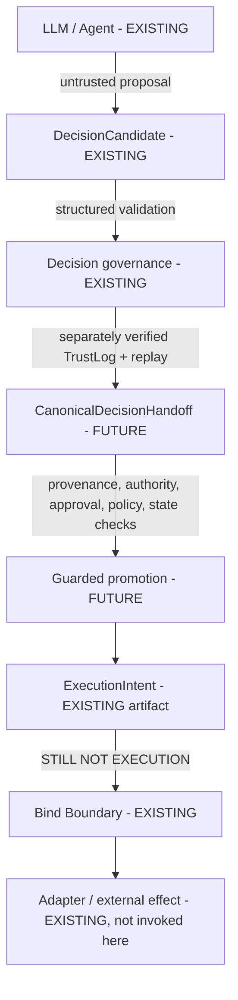

# Canonical Decision-to-Bind Handoff v1

## Status and scope

`CanonicalDecisionHandoff` is a **FUTURE**, reviewable, provenance-aware
envelope between decision-side evidence and a possible guarded
`DecisionCandidate` promotion. It is not an `ExecutionIntent`, `BindReceipt`,
command, Authority Evidence, or permission to execute. This specification and
its synthetic fixtures do not implement a validator or production bridge.

The current `/v1/decide` response exposes `request_id`, but does not expose a
canonical `decision_id`, `decision_hash`, or `decision_ts`. Those values remain
`UNAVAILABLE`/`UNRESOLVED`; `request_id`, an HTTP response hash, arrival time,
TrustLog retrieval time, CI time, and current time are not substitutes.

## State machine

| State | Meaning and transition |
|---|---|
| `INCOMPLETE` | Required information is unavailable or unresolved. A newly reconstructed envelope may become ready after verified evidence is supplied. |
| `REVIEW_REQUIRED` | Explicit policy requires human resolution; it never defaults to allow. |
| `INVALID` | Fail-closed refusal caused by mismatch, invalidity, staleness, substitution, ambiguity, or forbidden inference. Revalidate/reconstruct; do not promote. |
| `STRUCTURALLY_REFUSED` | Existing formation lineage is non-promotable. It is immutable and requires reconstruction from eligible lineage. |
| `READY_FOR_GUARDED_PROMOTION` | Only enough verified structured inputs exist to attempt a future guarded promotion. It does not authorize execution, call an adapter, make approval/authority perpetual, or bypass Bind. |

`EXECUTED` is deliberately absent. `STRUCTURALLY_REFUSED` MUST NOT mutate to
ready, even if authority or approval is later attached. Formation refusal is
not Bind `BLOCKED`.

The status classification is normative. `INCOMPLETE` means a required
canonical value or evidence is absent or unresolved and no supplied substitute
is positively invalid. `REVIEW_REQUIRED` means human or policy review is
explicitly required before readiness can be established. `INVALID` is reserved
for supplied material that is positively malformed, mismatched, stale,
expired, substituted, contradictory, or otherwise invalid.
`STRUCTURALLY_REFUSED` means formation lineage is non-promotable and cannot be
repaired by attaching later evidence. `READY_FOR_GUARDED_PROMOTION` requires
all v1 prerequisites and trusted verification conditions.

The mere presence of `ALLOW`, `APPROVE`, an authenticated identity, or similar
non-authoritative metadata does not make a handoff `INVALID`. Those values MUST
NOT satisfy authority, approval, action, target, policy, or state requirements.
Consequently, missing required Authority Evidence is `INCOMPLETE`, while
missing explicitly required Human Approval is `REVIEW_REQUIRED`. In both cases
the handoff stops and is never ready.

## Provenance and field envelope

Every security-relevant value uses a provenance record containing `value`,
`source_artifact_type`, `source_artifact_ref`, optional `source_hash`,
`verification_status`, `verification_mechanism`, optional `observed_at` or
`issued_at`, and optional `expires_at`/freshness data. An HTTP response is not
verified merely because it was received.

Canonical provenance classes are:

* `VERIFIED_RUNTIME_EVIDENCE`
* `VERIFIED_POLICY_ARTIFACT`
* `VERIFIED_AUTHORITY_EVIDENCE`
* `VERIFIED_HUMAN_APPROVAL`
* `VERIFIED_LIVE_STATE`
* `EXPLICIT_STRUCTURED_INPUT`
* `UNVERIFIED_STRUCTURED_INPUT`
* `DERIVED_CANONICALLY`
* `UNAVAILABLE`

`DERIVED_CANONICALLY` requires a versioned, deterministic derivation contract.
It is not permission to infer meaning from prose.

### Canonical READY coverage

Provenance is field-level for scalar execution/security inputs and object-level
at the named canonical boundary for compound evidence objects. Object-level
coverage prevents a compound artifact from being misleadingly represented as
independently verified fragments while retaining its canonical verification
boundary. Every `READY_FOR_GUARDED_PROMOTION` handoff requires exactly one
unique `field_path` record for, at minimum:

* `source_decision.request_id`, `source_decision.canonical_decision_id`,
  `source_decision.canonical_decision_hash`, and
  `source_decision.canonical_decision_ts`;
* `candidate.actor_identity`, `candidate.target_system`,
  `candidate.target_resource`, `candidate.canonical_action`, and
  `candidate_hash`;
* the compound-object boundaries `trustlog_lineage`, `replay_lineage`, and
  `policy_lineage`;
* the compound-object boundaries `authority_requirement` and
  `authority_evidence`;
* the compound-object boundaries `human_approval_requirement` and
  `human_approval_evidence`; and
* the compound-object boundary `expected_state` when state binding is required
  for the action.

Every record explicitly carries `value`, even when an unavailable value is
represented as `null` in a non-ready handoff. Every mandatory READY record has
`verification_status=VERIFIED` and MUST NOT use provenance class `UNAVAILABLE`
or `UNVERIFIED_STRUCTURED_INPUT`. Those classes and unverified statuses remain
valid structural representations for non-ready states, but cannot satisfy a
READY prerequisite. The JSON Schema enforces record structure; specification
coherence tests enforce READY fixture coverage; a future separately reviewed
runtime implementation would perform actual handoff validation.

## No-field-inference rule

Execution-formation fields MUST NOT be inferred from plausible language. The
following mappings are prohibited without a future explicit, typed, validated
source contract:

* `chosen.title` or `next_action` to `intended_action`;
* `business_decision=APPROVE`, `gate_decision=ALLOW`, or decision status to
  execution authority or Authority Evidence;
* `human_review_required=false` to verified approval-not-required, or `true`
  to evidence that approval occurred;
* authenticated API user or request `user_id` to authorized execution actor or
  Authority Evidence;
* LLM rationale to `target_resource` or `expected_state_fingerprint`;
* policy-looking text to canonical policy lineage.

A human-readable action description is reviewer context. A canonical action is
typed, explicit, canonicalized, and bound to its target. Existing action
contract IDs/versions should be referenced where applicable; prose from
`chosen`, `next_action`, rationale, or completion text is never authoritative.

The vector-level `forbidden_inference` field is test and documentation metadata,
not part of the `CanonicalDecisionHandoff` runtime input. A runtime validator
MUST NOT branch on it. Such a vector demonstrates that a tempting
non-authoritative source exists but does not satisfy a required trusted field;
it does not necessarily assert that the runtime artifact records an attempted
inference. Representing an actual semantic-laundering attempt would require a
separately specified typed artifact or provenance mechanism in a future
version.

## Requirements, evidence, and validation

`authority_requirement` states what authority is required. It does not show
that an actor possesses it. `authority_evidence` is a separately issued
artifact, and `validation_result` records verification. Evidence must bind the
exact actor, canonical action, target system, resource/scope, authority
type/role, issuer, validity period, evidence hash/ref, and verification status.
Actor, action, or target mismatch, expiry, or an unverified source fails closed
(`INVALID`, or `REVIEW_REQUIRED` only where explicit policy says so; never
allow by default). Authentication is not authorization; identity is not
execution authority; an API role is not authority for a target operation.

Likewise, `human_approval_requirement` says whether approval is required;
`human_approval_evidence` proves an approval receipt; and `validation_result`
records verification. Even `required=false` needs authoritative policy
provenance. A required receipt binds approver identity and scope, decision and
candidate reference, exact structured action including amount/subject, exact
target, approval timestamp, expiry, and receipt hash/ref. Approval for $100,
user A, action A, or resource A cannot authorize $10,000, user B, action B, or
resource B. Receipts are non-transferable and non-replayable outside scope.

## Source-of-truth matrix

Legend: “conditional” means only when that source's canonical contract
explicitly exposes and verifies the value. External means explicit typed input.
Live means authority, policy, or state verification. No field may be inferred.

| Future `ExecutionIntent` field | `/v1/decide` | TrustLog | Replay | External | Live | Infer? | Mandatory before attempt |
|---|---|---|---|---|---|---|---|
| `decision_id` | No today | conditional | conditional | no | lineage verify | NO | yes |
| `request_id` | yes | verify same | verify same | no | no | NO | yes |
| `policy_snapshot_id` | No authoritative value today | conditional | conditional | conditional | policy verify | NO | yes |
| `actor_identity` | conditional identity only | conditional | conditional | yes | authority binding | NO | yes |
| `target_system` | no authoritative action target | no | no | yes | scope/state | NO | yes |
| `target_resource` | no | no | no | yes | scope/state | NO | yes |
| `intended_action` | no (prose is insufficient) | no | no | yes, typed | authority/policy | NO | yes |
| `evidence_refs` | conditional | yes | yes | yes | verify each | NO | yes |
| `decision_hash` | No today | conditional | conditional | no | lineage verify | NO | yes |
| `decision_ts` | No today | conditional | conditional | no | lineage verify | NO | yes |
| `ttl_seconds` | no | conditional | conditional | conditional | policy freshness | NO | yes |
| `expected_state_fingerprint` | no | no | no | state request only | trusted state source | NO | when action requires state binding |
| `approval_context` | no | conditional | conditional | receipt | approval verify | NO | yes (including authoritative not-required) |
| `policy_lineage` | no authoritative lineage | conditional | conditional | policy artifact | policy verify | NO | yes |

All mandatory fields must have acceptable provenance, not merely non-empty
defaults. “Dataclass constructible” != “eligible for guarded promotion” !=
“bind admissible” != “execution allowed”.

## Lineage, hashes, policy, and state

The decision lineage must provide a canonical decision ID, hash, and timestamp
structurally or cryptographically linked to one decision. A future decision
hash contract must define domain separation, canonical serialization, format
version, included fields, excluded volatile fields, deterministic procedure,
and exclusion of its own hash. `SHA256(response.json())` is not a contract.
No canonical production decision hash exists for `/v1/decide` today.

TrustLog and replay are separate evidence. Each requires `verified=true`, its
verification mechanism, artifact identity/hash, the same `request_id` and
expected source decision identity. TrustLog chain verification and replay
verification must independently succeed. Cross-request, cross-decision, or
unrelated proof substitution yields `HANDOFF_REQUEST_LINEAGE_MISMATCH` or
`HANDOFF_SOURCE_ARTIFACT_MISMATCH`.

Policy lineage identifies snapshot ID, version, semantic digest, applicable
policy IDs, compiled governance identity where supported, effective/issued
time, expiry, and supersession state. Missing, stale, or prose-derived policy
lineage fails closed. Never fabricate `policy_snapshot_id`.

Target identifiers are explicit, typed, canonicalized, and action-bound. The
candidate target is covered by the candidate-hash binding described below;
`target_context` is checked separately against that target. Candidate mutation
after trusted candidate-hash verification invalidates eligibility.
`expected_state_fingerprint` is a trusted formation-time observation, never
model output; Bind-time live state is a separate observation used to detect
drift. Missing/stale required state fails closed.

For a `READY_FOR_GUARDED_PROMOTION` handoff, v1 requires exact equality between
`candidate.target_system` and `target_context.target_system`, and between
`candidate.target_resource` and `target_context.target_resource`. A difference
is a cross-field target-binding failure: the handoff is `INVALID` with
`HANDOFF_TARGET_CONTEXT_MISMATCH`. It does not by itself establish a candidate
hash mismatch. V1 defines no wildcard, hierarchy, alias, or scope-expansion
semantics; richer target equivalence requires a separate explicit contract.

### Candidate-hash verification boundary

The v1 `candidate_hash` is an opaque hash or reference value. This specification
does not define a canonical production algorithm for hashing the handoff's
candidate shape, which includes `candidate.canonical_action`. The existing
`hash_decision_candidate(...)` function applies to the existing runtime
`DecisionCandidate` schema and MUST NOT be reused unless a future contract
explicitly establishes schema and hash-profile compatibility. In particular, a
future validator MUST NOT assume that `SHA256(candidate JSON)` is the canonical
candidate-hash contract.

READY requires a trusted upstream verifier to assert that the supplied
`candidate_hash` binds the exact supplied candidate under the verifier's
declared hash/profile contract. A future trusted validation context will express
this with a typed `CandidateHashBindingAssertion` containing at least:

* `candidate_value_digest`;
* `asserted_candidate_hash`;
* `source_artifact_ref`;
* `source_hash`;
* `verification_mechanism`; and
* the fixed semantic claim `CANDIDATE_HASH_BINDS_CANDIDATE`.

An **assertion-value digest** is distinct from a domain or artifact hash. It is
a deterministic local digest used only to bind a trusted assertion to the exact
current JSON value, so an assertion about value A cannot be reused after a
change to value B. It is not `candidate_hash`, `decision_hash`, Authority
Evidence hash, or approval receipt hash, and MUST NOT redefine any of them.
Those domain hashes remain governed by their producer/verifier contracts. A
future validator may recompute the assertion-value digest to detect candidate
substitution, but MUST NOT claim that doing so independently recomputes the
canonical candidate hash.

`HANDOFF_CANDIDATE_HASH_MISMATCH` applies only when the exact current
`candidate` object differs from the object bound by that trusted assertion.
This includes mutation of its target, canonical action, actor, or any other
candidate field covered by the assertion. A change outside `candidate`, such as
substitution of `target_context`, does not produce this reason unless the
candidate itself also fails its trusted binding.

A valid `CandidateHashBindingAssertion` proves only that its trusted verifier
verified the supplied `candidate_hash` as binding the exact current candidate.
It does not prove that `target_context`, Authority Evidence, Human Approval,
applicable policy, or expected state matches that candidate. Those are separate
validation properties and MUST be checked independently. This separation is
security-critical.

## Formation invariant and reason codes

The handoff consumes existing `lineage_promotability` and
`transition_refusal`. A bind-eligible artifact cannot emerge from a
non-promotable lineage; repackaging or later evidence cannot resurrect it.

Canonical specification-only reason codes are:

`HANDOFF_MISSING_CANONICAL_DECISION_ID`,
`HANDOFF_MISSING_CANONICAL_DECISION_HASH`,
`HANDOFF_MISSING_DECISION_TIMESTAMP`, `HANDOFF_TRUSTLOG_UNVERIFIED`,
`HANDOFF_REPLAY_UNVERIFIED`, `HANDOFF_REQUEST_LINEAGE_MISMATCH`,
`HANDOFF_CANDIDATE_HASH_MISMATCH`, `HANDOFF_TARGET_CONTEXT_MISMATCH`,
`HANDOFF_LINEAGE_NON_PROMOTABLE`,
`HANDOFF_TARGET_UNSPECIFIED`, `HANDOFF_ACTION_UNSPECIFIED`,
`HANDOFF_ACTOR_UNSPECIFIED`, `HANDOFF_AUTHORITY_REQUIREMENT_UNRESOLVED`,
`HANDOFF_AUTHORITY_EVIDENCE_MISSING`, `HANDOFF_AUTHORITY_EVIDENCE_INVALID`,
`HANDOFF_AUTHORITY_EVIDENCE_EXPIRED`,
`HANDOFF_APPROVAL_REQUIREMENT_UNRESOLVED`,
`HANDOFF_APPROVAL_EVIDENCE_MISSING`, `HANDOFF_APPROVAL_EVIDENCE_INVALID`,
`HANDOFF_APPROVAL_EVIDENCE_EXPIRED`, `HANDOFF_POLICY_LINEAGE_MISSING`,
`HANDOFF_POLICY_LINEAGE_STALE`, `HANDOFF_EXPECTED_STATE_MISSING`,
`HANDOFF_EXPECTED_STATE_STALE`, `HANDOFF_AMBIGUOUS_ACTION`, and
`HANDOFF_SOURCE_ARTIFACT_MISMATCH`.

## Compatibility and current proof architecture

`try_promote_decision_candidate_to_execution_intent(...)` validates the
candidate schema and accepts separately supplied decision, request, policy,
hash, timestamp, state, approval, and lineage parameters. Supplying parameters
does not prove common lineage, hash authenticity, authority, exact-operation
approval, verified/live state, fresh policy, or TrustLog/replay linkage. This
handoff must establish those stronger preconditions before a future real flow
may use the helper; this specification does not call or modify it.

The current proof mapping is:

* #2097, External Bind Boundary PoC: synthetic Decision Candidate → real Bind
  adjudication → real `WebhookBindAdapter` → `COMMITTED` / `BLOCKED` /
  `ROLLED_BACK`. It does not call real `/v1/decide`.
* #2098, Decision Pipeline PoC: real authenticated `/v1/decide` → real
  decision/governance runtime → controlled provider output → verified TrustLog
  and replay → `DecideResponse` → STOP. It creates no `ExecutionIntent` and
  does not invoke Bind.
* #2099, Runtime Proof Evidence CI: independently executes and verifies the
  #2098 Decision proof and #2097 Bind proof, then emits a SHA-256 manifest, CI
  provenance, and downloadable reviewer artifact. Packaging both does not
  create lineage between them.

No canonical Decision → ExecutionIntent → Bind lineage is proven. #2100
specifies the missing boundary; it does not fill it.

## Explicit non-claims

This specification does **not** prove live Decision-to-Bind integration,
production DecisionArtifact creation, canonical decision hash implementation,
live Authority Evidence integration, live IAM/IdP validation, live Human
Approval integration, live state snapshotting, execution authority, real
DecisionCandidate extraction from `/v1/decide`, ExecutionIntent creation from
`/v1/decide`, Bind invocation from `/v1/decide`, live external effect, customer
deployment, bank integration, regulatory approval, certification, or production
readiness. Schema conformance is structural only and never makes an artifact
executable.
