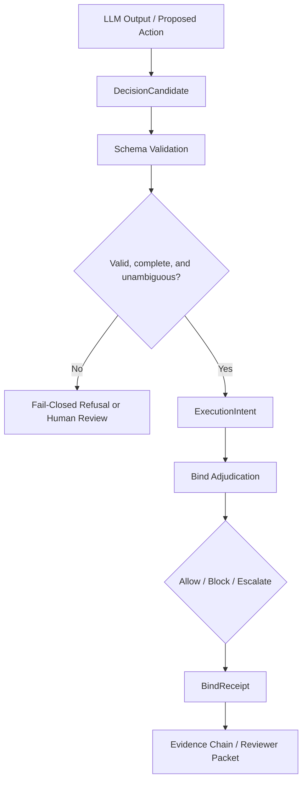

# LLM-to-Control-Plane Contract

## 1. Purpose

This document defines the contract boundary between LLM-generated outputs and the non-LLM governance components in VERITAS.

VERITAS treats LLMs as candidate generators, not final governance authorities. An LLM may propose an action, summarize context, or provide candidate reasoning, but VERITAS does not rely on LLM self-auditing and does not ask the LLM to govern itself.

Before an execution candidate can become an `ExecutionIntent`, VERITAS requires structured, inspectable, policy-relevant fields that can be evaluated by the external VERITAS control plane.

## 2. Problem

LLM outputs and governance control planes have different operating models:

- LLMs often produce natural language, ambiguous reasoning, or multiple possible actions.
- Non-LLM governance components require structured, typed, policy-relevant data.
- If this boundary is not explicit, external reviewers may reasonably worry that VERITAS is still relying on LLM interpretation.
- Natural language should not be treated as directly executable governance input.

The purpose of this contract is to make the pre-`ExecutionIntent` boundary explicit. LLM output must be converted into a structured decision candidate, validated, and either rejected, sent to human review, or promoted into an `ExecutionIntent` for downstream bind adjudication.

## 3. Contract flow

The key boundary is between unstructured LLM output and the structured `DecisionCandidate`. The LLM may inform the candidate, but the non-LLM control plane validates whether the candidate is complete, unambiguous, and eligible for promotion.

## 4. Candidate fields

`DecisionCandidate` is a proposed v1 conceptual structure. This PR documents the contract only; it does not add a runtime schema or change API behavior.

A conceptual `DecisionCandidate` should include fields such as:

- `candidate_id`
- `source_model`
- `source_trace_ref`
- `candidate_type`
- `action_type`
- `actor_identity`
- `target_system`
- `target_resource`
- `intended_action`
- `required_authority`
- `required_human_approval`
- `risk_level`
- `evidence_refs`
- `policy_context_refs`
- `ambiguity_flags`
- `missing_required_fields`
- `candidate_rationale_ref`

The rationale may be useful for reviewer context, but it is not a substitute for structured fields. A candidate that only contains natural-language reasoning is not sufficient for non-LLM governance evaluation.

## 5. Promotion rule

A `DecisionCandidate` may become an `ExecutionIntent` only when all of the following are true:

- Required fields are present.
- Target system and target resource are explicit.
- Intended action is explicit.
- Actor identity is explicit or resolvable.
- Required authority and approval requirements are represented.
- Ambiguity flags are empty or explicitly resolved.
- Missing required fields are empty.
- Policy-relevant fields are typed enough for non-LLM evaluation.

Promotion is not a statement that execution is allowed. Promotion only means the candidate is structured enough to enter downstream bind adjudication.

## 6. Fail-closed rule

A candidate must not be promoted to `ExecutionIntent` when any of the following are true:

- Required fields are missing.
- The action is ambiguous.
- Target resource is unclear.
- Actor identity is unknown.
- Authority requirements cannot be determined.
- Human approval requirement is unclear.
- Risk classification is indeterminate for a regulated or high-impact action.
- The candidate depends only on natural-language rationale without structured fields.

In these cases, the correct outcome is one of:

- fail-closed refusal;
- `human_review_required`; or
- reconstruction of the candidate from clearer structured input.

## 7. Relationship to existing VERITAS components

This contract connects to existing VERITAS governance artifacts and checks as follows:

- `ExecutionIntent` remains the downstream execution attempt descriptor.
- `DecisionCandidate` is the pre-`ExecutionIntent` candidate contract.
- `BindReceipt` records the bind adjudication result and supporting decision evidence.
- `BindAdapterContract` defines how effect-bearing adapters expose bind-relevant operation metadata.
- Authority Evidence supplies structured evidence about whether the actor has required authority.
- Human Approval Receipt supplies structured evidence about required human approval.
- Risk, Constraint, and Drift checks evaluate policy-relevant properties after the candidate has been structured enough for non-LLM evaluation.
- Evidence Chain Manifest and Evidence Chain Verification connect governance artifacts into an auditable local/offline chain.
- Reviewer Evidence Packet packages selected evidence for external inspection.

Bind does not manufacture legitimacy. Invalid, ambiguous, or incomplete candidates should not be made bind-eligible merely because an LLM produced plausible language or rationale.

## 8. Boundary and limitations

- This is not legal advice.
- This is not regulatory approval.
- This is not third-party certification.
- This does not claim live IAM, IdP, SaaS, bank, sanctions, or customer-system integration.
- This PR documents the contract; it does not implement production-grade LLM extraction, enterprise workflow integration, or live authority-source validation.
- Fixture-backed or local/offline evidence must not be presented as live production integration.
