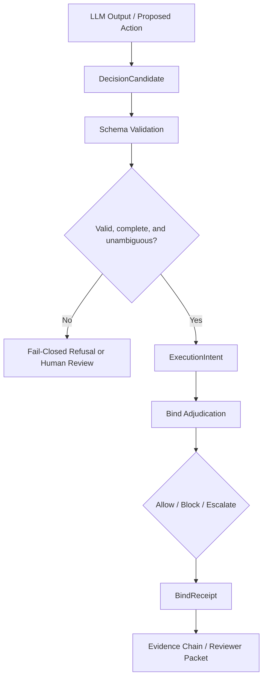

# LLM-to-Control-Plane Contract（LLMと制御プレーンの責任分界）

## 1. 目的

この文書は、LLM が生成する出力と、VERITAS の非 LLM ガバナンスコンポーネントとの境界契約を定義します。

VERITAS における LLM は、最終判断者ではなく候補生成者です。LLM は行動案、文脈の要約、候補となる理由付けを提示できますが、VERITAS は LLM に自己監査させる仕組みではありません。最終的な実行前ガバナンス判断は、LLM の外側にある VERITAS の制御プレーンが担います。

実行候補が `ExecutionIntent` になる前に、VERITAS は構造化され、検査可能で、ポリシー評価に必要なフィールドを要求します。

## 2. 問題

LLM 出力とガバナンス制御プレーンには、次のようなインピーダンスミスマッチがあります。

- LLM は自然言語、曖昧な理由付け、複数の可能な行動を出力しがちです。
- 非 LLM のガバナンスコンポーネントは、構造化され、型付けされ、ポリシーに関係するデータを必要とします。
- この境界が明示されていないと、外部レビュアーは VERITAS が依然として LLM の解釈に依存しているのではないかと懸念できます。
- 自然言語をそのまま実行可能なガバナンス入力として扱ってはいけません。

この契約の目的は、`ExecutionIntent` より前の境界を明確にすることです。LLM 出力は `DecisionCandidate` として構造化され、検証され、拒否、人間レビュー、または `ExecutionIntent` への昇格のいずれかに進みます。

## 3. 契約フロー

重要な境界は、非構造の LLM 出力と、構造化された `DecisionCandidate` の間にあります。LLM は候補作成に情報を与えることはできますが、その候補が完全で、曖昧でなく、昇格可能かどうかは非 LLM の制御プレーンが検証します。

## 4. 候補フィールド

`DecisionCandidate` v1 は、`veritas_os/policy/decision_candidate.py` にある
追加的でランタイム中立のスキーマとして表現されています。このスキーマは
`ExecutionIntent` より前の境界に対する検証および昇格ヘルパーを提供しますが、
`/v1/decide` の挙動や public API のレスポンス形状は変更しません。

概念的な `DecisionCandidate` には、次のようなフィールドを含めます。

- `candidate_id`
- `source_model`
- `source_trace_ref`
- `candidate_type`
- `action_type`
- `actor_identity`
- `target_system`
- `target_resource`
- `intended_action`
- `required_authority`
- `required_human_approval`
- `risk_level`
- `evidence_refs`
- `policy_context_refs`
- `ambiguity_flags`
- `missing_required_fields`
- `candidate_rationale_ref`
- `metadata`

理由付けはレビュアーの文脈理解には役立ちますが、構造化フィールドの代替にはなりません。自然言語の理由だけに依存する候補は、非 LLM ガバナンス評価の入力として十分ではありません。

`DecisionCandidate` v1 には、正規化ヘルパーと、例外を投げずに昇格または拒否を表す標準的な結果オブジェクトも含まれます。正規化は文字列の trim、リストフィールドの正規化、不明確な承認値のレビュー向け構造値への変換を行えますが、正規化されたことは実行許可を意味しません。`ExecutionIntent` への昇格には引き続き検証が必要であり、拒否された候補は昇格されないまま構造化された promotion result として表現できます。これらのヘルパーは追加的なものであり、`/v1/decide` には接続されず、public API のレスポンス形状を変更せず、live LLM extraction も、IAM、IdP、SaaS、銀行、制裁リスト、顧客システムに対するライブ権限検証も行いません。

昇格されなかった `DecisionCandidate` の結果は、
`DecisionCandidateRefusalArtifact` として表現することもできます。refusal artifact
は、候補が `ExecutionIntent` にならなかった理由を記録するものであり、fail-closed
または人間レビュー必須の結果をレビュアーが検査するための
pre-`ExecutionIntent` evidence です。これは `BindReceipt` ではなく、実行が試行された
ことを意味せず、live LLM extraction、live authority-source validation、bind
adjudication も行いません。この artifact の reviewer-facing packet の例は、後続 PR
で明示的に統合されるまでは local/offline fixture-backed evidence のままです。

`DecisionCandidateRefusalArtifact` には内部レビュー文脈が含まれる場合があります。
外部レビューには、`DecisionCandidateRefusalReviewerExport` がより安全な redacted
view です。これは拒否理由コード、candidate hash、artifact hash、promotion status
を保持しつつ、raw candidate snapshot、raw validation snapshot、自然言語の生内容、
prompt、token、credential、機微な metadata を省略します。この export は実行試行を
意味せず、`BindReceipt` ではなく、live integration や bind adjudication も行いません。

## 5. 昇格ルール

`DecisionCandidate` は、次の条件をすべて満たす場合にのみ `ExecutionIntent` へ昇格できます。

- 必須フィールドが存在する。
- 対象システムと対象リソースが明示されている。
- 意図された行動が明示されている。
- 行為者の identity が明示されている、または解決可能である。
- 必要な権限と人間承認の要件が表現されている。
- `ambiguity_flags` が空、または明示的に解決済みである。
- `missing_required_fields` が空である。
- ポリシーに関係するフィールドが、非 LLM 評価に十分な程度に型付けされている。

昇格は、実行を許可するという意味ではありません。昇格は、その候補が downstream の bind adjudication に入れる程度に構造化されている、という意味だけです。

## 6. Fail-closed ルール

次のいずれかに該当する候補は、`ExecutionIntent` に昇格してはいけません。

- 必須フィールドが不足している。
- 行動が曖昧である。
- 対象リソースが不明確である。
- 行為者 identity が不明である。
- 権限要件を判断できない。
- 人間承認の要否が不明確である。
- 規制対象または高影響アクションについて、リスク分類が不定である。
- 構造化フィールドではなく自然言語の理由付けだけに依存している。

この場合の正しい結果は、次のいずれかです。

- fail-closed refusal;
- `human_review_required`; または
- より明確な構造化入力から候補を再構築すること。

## 7. 既存の VERITAS コンポーネントとの関係

この契約は、既存の VERITAS ガバナンス成果物やチェックと次のようにつながります。

- `ExecutionIntent` は downstream の実行試行記述子のままです。
- `DecisionCandidate` は `ExecutionIntent` より前の候補契約です。
- `BindReceipt` は bind adjudication の結果と関連する判断証跡を記録します。
- `BindAdapterContract` は effect-bearing adapter が bind に必要な操作メタデータを公開する方法を定義します。
- Authority Evidence は、行為者が必要な権限を持つかどうかの構造化証拠を提供します。
- Human Approval Receipt は、必要な人間承認に関する構造化証拠を提供します。
- Risk / Constraint / Drift checks は、候補が非 LLM 評価に十分な形へ構造化された後で、ポリシー関連の性質を評価します。
- Evidence Chain Manifest / Verification は、ガバナンス成果物を監査可能な local/offline chain として接続します。
- Reviewer Evidence Packet は、外部レビュー向けに選択された証跡をまとめます。

Bind は legitimacy を作り出すものではありません。LLM がもっともらしい自然言語や理由付けを出しただけで、無効、曖昧、または不完全な候補を bind 対象にしてはいけません。

## 8. 境界と制限

- これは法的助言ではありません。
- これは規制当局による承認ではありません。
- これは第三者認証ではありません。
- 本番の IAM、IdP、SaaS、銀行、制裁リスト、顧客システムとのライブ統合を主張しません。
- 追加されたスキーマは live LLM extraction を追加しません。
- 追加されたスキーマは `/v1/decide` に接続されておらず、API 挙動を変更しません。
- 追加されたスキーマは外部権限ソースのライブ検証を行いません。
- この契約とスキーマは、本番グレードの LLM parsing、企業ワークフロー統合、外部権限ソースのライブ検証を実装するものではありません。
- fixture-backed または local/offline の証跡を、本番ライブ統合として提示してはいけません。
